# 定制礼物需求文档

> 版本：2.1.40　｜　状态：评审稿，已落实人工确认规则，仍含未决边界。
>
> 本文结合当前《定制礼物需求.xmind》、指定目录中的独立原型与全交互图，以及业务建模和逻辑审查结果编写。脑图定义业务规则，原型补充页面及交互；两者冲突时列入待确认，不自行设定优先级。建模稿中已被审查指出的推断，不作为已确认需求继承。

## 1. 需求范围

### 1.1 业务目标

为满足定制权益条件的用户提供礼物名称、价格、封面和动效的配置能力；在礼物栏增加定制礼物分类，提供定制礼物排行榜入口、所选礼物榜一用户展示，以及按本月与上月有效充值金额中的最高值匹配边框样式。

### 1.2 模块与阅读索引

| 模块 | 页面/规则范围 | 正文位置 | 当前状态 |
|---|---|---|---|
| 定制礼物栏 | 分类、顶部Banner、所选礼物榜一头像、礼物排序与赠送入口 | 4.1 | 榜一、周排序和到期隐藏规则已确认；空态提示本次不处理 |
| 定制礼物排行榜 | Rank/Upload、本周/上周、榜单展示、刷新提示 | 4.2 | 排行主体与周期排序口径已确认；展示映射及边界规则部分待确认 |
| 未获得权益 | 权益卡、How to get、问号、获取方式 | 4.3 | 权益来源收敛为月度充值活动；发放失败及退款规则待确认 |
| 上传空状态 | 名称、价格、封面、动效、上传按钮、剩余天数 | 4.4 | 最低价及首次计次已确认；素材校验本次不处理 |
| 已填写未提交 | 内容展示、上传动作、提交结果边界 | 4.5 | 成功提交后立即展示可赠送；失败与幂等仍待确认 |
| 已填写本月已提交 | 内容修改、收费确认、价格锁定限制 | 4.6 | 字段独立免费次数及非价格付费修改已确认；价格每自然月只能设置或修改1次，月内不得二次改价 |
| 共用业务规则 | 权益、价格、修改额度、时间、统计、边框 | 2、5 | 已知规则与缺口分开记录 |
| 后台定制礼物管理 | 定制礼物列表、详情、筛选、导出及展示状态操作 | 5.7 | 无素材审核；成功操作后客户端立即生效；后台角色、权限及审计仍待确认 |

### 1.3 材料与范围边界

- 本次原型范围为 `2.1.40原型图` 中的六张独立页面图及一张全交互流程图。
- 本文只描述定制礼物相关能力。房间座位、玩法、其他礼物分类与系统状态栏不作为新增需求展开。
- 原型中的名称、价格、排名数值、头像及剩余23天均为示例，不作为默认业务配置。
- 同版本目录已有后台HTML及其完整页面导出图，本次将其作为后台页面结构、字段和可见交互的原型证据；示例数据不等于正式配置。定制礼物无需素材审核，成功提交或成功修改后客户端立即生效；后台角色、权限、操作理由与审计规则仍待确认。
- 下文“待确认Uxx”对应第6节。它表示需求尚未明确，不是页面新增状态、系统报错或实际执行步骤。

## 2. 业务模型与统一口径

### 2.1 角色

| 角色 | 业务职责 | 权限边界 |
|---|---|---|
| 使用礼物面板的用户 | 查看定制礼物、选择打赏对象、发起赠送、查看榜单 | 上传权益用于配置礼物；材料没有把上传权益定义为赠送资格，不将两者混为同一权限 |
| 定制礼物权益用户 | 设置名称、价格、封面和动效，使用相应修改权益 | 权益获得方式、有效期和修改次数分别管理；获得权限不直接等于礼物已生效 |
| 打赏对象 | 接收用户赠送的定制礼物 | 收礼资产及收益换算规则未提供，见U09 |
| 后台管理人员 | 查看定制礼物列表与详情，并按已确认权限执行展示状态维护 | 原型可见的查看、下架、恢复、导出和查询入口不等于最终授权；角色、数据范围及操作权限见U07 |

### 2.2 核心对象

| 对象 | 定义 | 与其他对象的关系 | 不可混用的概念 |
|---|---|---|---|
| 定制礼物权益 | 用户通过月度充值活动获得的配置资格，每次成功发放增加30天 | 同一用户每个UTC+3自然月最多成功获得1次；有效权益在原到期时间上顺延30天，无有效权益时从发放成功时间起算；次月达标形成新的权益发放记录，但沿用同一定制礼物业务身份 | 权益发放次数、权益有效天数和礼物数量不是同一个指标；一份权益对应几份礼物仍待确认 |
| 定制礼物 | 由名称、金币价格、封面及动效组成的礼物内容 | 成功提交后无需审核，立即在礼物栏展示并可赠送；修改处理中继续使用旧内容，修改成功后立即切换新内容 | 已填写未提交不等于可赠送；权益到期后礼物栏隐藏，但礼物身份及历史记录继续保留 |
| 价格设置资格 | 每个自然月只有1次设置或修改礼物价格的机会，首次设置即占用当月次数 | 价格成功设置后当月锁定，月内不得二次改价；次月新价格成功生效后替换旧价格 | 改价机会不是金币余额，也不属于非价格信息的免费或付费修改机会；300000金币付费修改不得增加改价次数 |
| 内容修改权益 | 名称、封面、动效三个字段分别拥有每自然月1次免费机会；首次成功上传分别占用各字段当月免费次数 | 无实际变化不计次；任一实际变化字段的免费次数已用时，本次提交收取300000金币；付费修改次数不限；扣费和次数实际消耗时点见U06 | 价格不属于该付费修改范围；同一次提交无论包含一个或多个超额字段，合计只收取一次300000金币 |
| 礼物赠送金额 | 指定定制礼物发生赠送时对应的金币金额 | 为礼物栏排序和所选礼物榜一用户判断提供统计依据 | 礼物标价、赠送金额、修改费用分开表达 |
| 边框样式 | 按定制礼物所属用户统计本月与上月活动有效充值金额并取最高值，实时匹配定制礼物外观 | 低于US$2,000显示基础默认样式；达到US$2,000显示普通档位；达到US$3,000显示高级档位；月切时重新匹配 | 边框档位不直接代表上传权益来源或修改次数；全部存量礼物同步使用当前匹配结果 |

### 2.3 三种统计展示分别定义

| 展示 | 排序/判断对象 | 已明确口径 | 尚未明确部分 |
|---|---|---|---|
| 定制礼物栏排序 | 不同定制礼物 | 按UTC+3自然周统计本周赠送金额并降序；同额时先达到该金额的礼物靠前；零赠送礼物按权益获得时间升序 | 同时达到同额、权益获得时间相同的最终稳定排序仍待确认；赠送事实沿用普通礼物规则 |
| 所选礼物榜一用户头像 | 向同一个定制礼物贡献赠送金币的不同用户 | 选择某个定制礼物后，展示UTC+3自然周内赠送该礼物金币数量最高且最先达到该金额的用户头像 | 无贡献及身份失效时的占位表现本次不处理；同时达到同额的最终稳定排序仍待确认 |
| Rank页面 | 不同定制礼物 | 本周榜按本周每个定制礼物被成功赠送的金币总金额降序；上周榜按上周每个定制礼物被成功赠送的金币总金额降序 | 大图、名称与右侧数值分别承接礼物封面、礼物名称和对应周期赠送金币总金额；小圆图与其名称展示对应周期内赠送该礼物金币金额最高且最先达到该金额的榜一用户；UTC+3自然周、上周冻结、零赠送排序已确认，退款/撤销处理沿用普通礼物规则 |

### 2.4 状态分层

| 层级 | 状态/阶段 | 进入依据 | 页面及后续影响 |
|---|---|---|---|
| 权益 | 未获得 | 用户尚未获得定制礼物权益 | 展示4.3，不以空白上传表单代替权益引导 |
| 权益 | 有效期内 | 每次成功发放增加30天；当前仍有效时从原到期时间顺延，无有效权益时从发放成功时间起算 | 可承接上传配置；每个UTC+3自然月最多成功获得1次 |
| 权益 | 到期 | 有效期限结束 | 礼物从定制礼物栏隐藏，Upload入口进入未获得权益状态；礼物身份和历史记录继续保留，次月达标后形成新权益发放记录 |
| 表单 | 空状态 | 原型展示名称、价格为空，封面及动效待选择 | 展示4.4 |
| 表单 | 已填写未提交 | 名称、价格及素材均已填入当前表单 | 展示4.5，不代表礼物已经可赠送 |
| 表单 | 已填写本月已提交 | 当前礼物已有本月提交内容 | 展示4.6；允许修改的字段与次数见5.3 |
| 价格 | 已设置后的月内限制 | 每个自然月只能设置或修改1次；价格成功设置后当月锁定，任何月内二次改价均不允许提交 | 锁定及次数实际落账时点仍见U06 |
| 礼物可用性 | 成功提交后生效 | 无需审核，成功提交后立即在礼物栏展示并可赠送；修改期间使用旧内容，修改成功后客户端立即切换 | “成功提交”的事务完成点、失败恢复和重复提交仍见U06 |

## 3. 业务流程

### 3.1 全交互原型

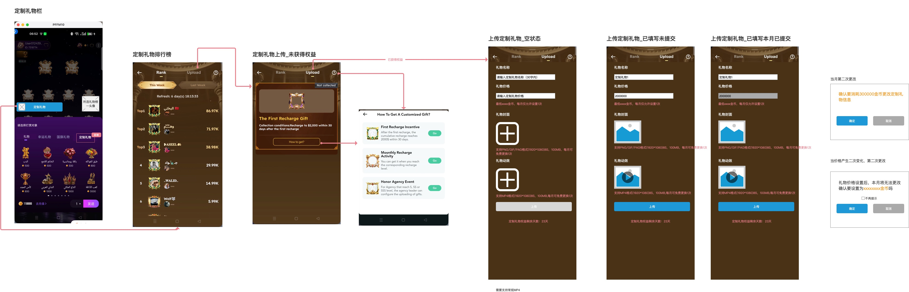

全图用于定位入口和页面关系；具体字段、规格与弹窗注释按第4节各独立原型逐项描述。全图和独立图没有证明的状态跳转不补成确定规则。

### 3.2 主流程

实线表达材料能够确认的路径；虚线表达尚待决策的衔接，不表示实际页面提示或已确定的执行结果。

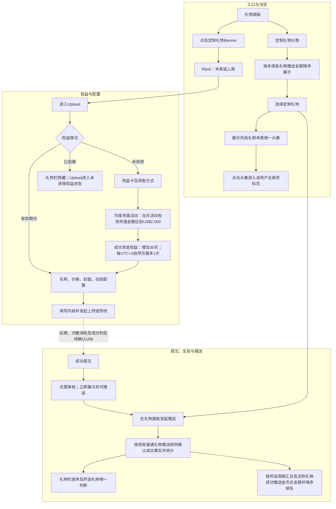

### 3.3 提交与修改的边界流程

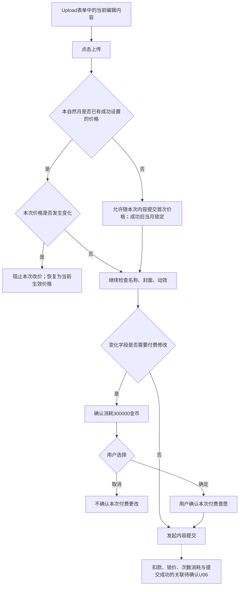

价格与非价格信息分别判断：月内已成功设置价格后，任何价格变化都直接阻止，不进入确认后可改价的流程；300000金币付费确认仅适用于名称、封面、动效。确认操作与扣款成功、次数消耗、价格锁定和礼物生效不合并成同一个结果。

## 4. 客户端功能需求

### 4.1 定制礼物栏

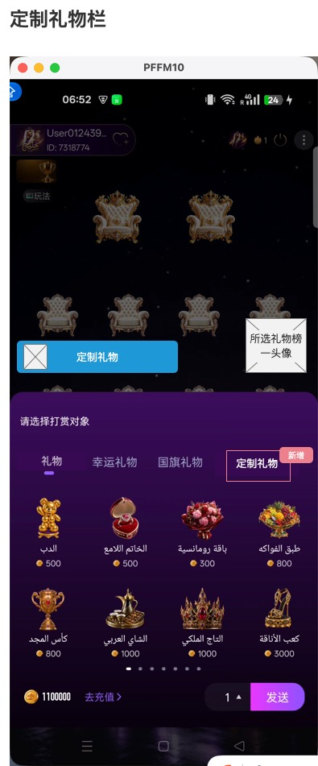

#### 4.1.1 页面定位与前置条件

在房间礼物面板中增加“定制礼物”分类。顶部定制礼物Banner承接排行榜入口，所选礼物榜一头像承接该用户全屏资料页入口。

原型中的“新增”红色标注用于说明版本变化，不直接作为客户端常驻角标。Banner和榜一头像是不同点击目标，不将整块区域统一跳转榜单。

#### 4.1.2 页面字段

| 区域/字段 | 展示与操作 | 数据来源/统计方式 |
|---|---|---|
| 定制礼物Tab | 在礼物分类中增加“定制礼物”，用于展示本类礼物 | 当前定制礼物集合；默认选中分类未定义 |
| 定制礼物Banner | 位于礼物面板上方，点击进入定制礼物排行榜 | 固定入口；是否依赖已选礼物见U01 |
| 所选礼物榜一头像 | 位于礼物面板上方右侧，显示当前选择礼物的本周榜一用户 | 按UTC+3自然周比较各用户本周赠送金币累计量；同额时先达到该金额者为榜一 |
| 礼物图与名称 | 礼物网格展示对应礼物内容 | 定制礼物的可展示名称及封面；生效条件见U07 |
| 礼物金币价格 | 每个礼物展示对应金币价格 | 该礼物当前有效价格；不使用原型示例价作为统一价格 |
| 礼物边框 | 展示定制礼物所属用户当前匹配的边框样式 | 5.6；按本月与上月活动有效充值金额最高值匹配：低于US$2,000为基础默认样式，达到US$2,000为普通档，达到US$3,000为高级档 |
| 打赏对象 | 原型展示“请选择打赏对象” | 当前房间赠送对象；多选、自送等范围见U09 |
| 金币余额/去充值 | 显示余额并提供充值入口 | 用户当前金币余额；充值落点不在材料中展开 |
| 数量/发送 | 选择数量后发起定制礼物赠送 | 原型数量示例为1；可选档位和发送规则见U09 |

#### 4.1.3 交互逻辑

**入口与切换**

1. 用户打开礼物面板，可见定制礼物分类入口。
2. 切换至定制礼物分类后，按UTC+3自然周统计本周各礼物赠送金额并降序排列；同额时先达到该金额者靠前，零赠送礼物按权益获得时间升序。
3. 点击定制礼物Banner进入4.2。该入口与所选礼物榜一头像的点击行为独立。

**选择与查看**

1. 选择某个定制礼物，榜一头像关联到该礼物，不沿用其他礼物的榜一信息。
2. 点击该头像进入其对应用户的全屏资料页，依据脑图明确规则。
3. 榜一金额同额时，先达到该金额的用户优先；未选择礼物、无人赠送及身份失效时的头像占位表现本次不处理。

**赠送**

用户通过打赏对象、数量和发送按钮发起赠送。对象、数量、资格、扣费、收礼结果、失败、退款和撤销均完全沿用系统现有普通礼物赠送规则；本需求不凭上传权益限制普通用户的赠送资格，也不新增赠送奖励。

#### 4.1.4 状态与异常

| 场景 | 处理口径 |
|---|---|
| 有礼物列表 | 按本周礼物金额降序展示 |
| 用户更换所选礼物 | 所展示榜一用户对应新选择的礼物 |
| 没有可展示的定制礼物 | 空态样式、Banner和头像是否保留见U12 |
| 所选礼物在赠送前失效 | 发送是否拦截、如何提示以及列表更新见U07、U09 |
| 周切换/同额/无人赠送 | 使用UTC+3自然周；同额先达到者靠前；零赠送礼物按权益获得时间升序；占位及Refresh表现本次不处理 |

### 4.2 定制礼物排行榜

#### 4.2.1 页面定位与前置条件

承接定制礼物Banner入口，提供Rank与Upload两类功能。当前原型展示Rank页，支持本周和上周两个时间选项。

**排行主体与排序口径：** Rank页面以“定制礼物”为排行主体，不按礼物拥有者或送礼用户排行。本周榜分别汇总每个定制礼物在本周内所有成功赠送记录的金币金额，按汇总金额降序排列；上周榜分别汇总每个定制礼物在上周内所有成功赠送记录的金币金额，按汇总金额降序排列。两个周期独立计算，不使用本周实时数据反推上周榜。失败、取消或未实际扣款的赠送不计入；退款、撤销及冲正后的扣减与重排规则见U08、U09。

#### 4.2.2 页面字段

| 字段/控件 | 展示及交互 | 数据来源/统计方式 |
|---|---|---|
| 返回 | 页面左上角返回入口 | 返回目标与是否恢复房间礼物面板见U12 |
| Rank | 排行榜功能标签，当前原型选中 | 当前榜单页 |
| Upload | 点击进入定制礼物上传相关页面 | 按权益情况分流，不直接固定跳空表单 |
| 问号 | 页面帮助入口 | 未获得权益页同类问号有明确获取方式连线；此页是否共用见U12 |
| This Week | 展示本周榜单，原型中高亮 | 按UTC+3自然周实时统计当前周 |
| Last Week | 展示上周榜单 | 上周自然周结束后冻结排名与金额；历史图文展示当前内容还是周期图文仍待确认 |
| Refresh | 原型显示剩余天数及时间 | 示例“6 day(s) 18:13:33”；倒计时对应周期结束还是其他刷新机制见U08 |
| 排名 | 前列为Top1、Top2、Top3，后续使用数字 | 按所选周期内各定制礼物被成功赠送的金币总金额降序产生；不将截图可见行数当展示上限 |
| 大图及边框 | 每行主要图形 | 对应当前排名定制礼物的封面及边框；历史周期读取当前内容还是周期快照见U08 |
| 名称 | 主要图形右侧名称 | 对应当前排名定制礼物的礼物名称；历史周期读取当前名称还是周期快照见U08 |
| 小圆图与名称 | 礼物名称下方的附属信息 | 展示所选周期内赠送该礼物金币金额最高且最先达到该金额的榜一用户头像和名称 |
| 右侧数值 | 示例86.97K等 | 对应定制礼物在所选周期内被成功赠送的金币总金额；单位缩写与展示精度见U08 |

#### 4.2.3 交互逻辑

1. 从Banner进入Rank页，原型展示本周选项为选中状态；是否每次重进都重置本周，见U12。
2. 切换This Week/Last Week时，分别读取本周榜或上周榜：本周榜按UTC+3当前自然周实时统计，上周榜在上一自然周结束后冻结排名与金额；两个周期独立计算。
3. 点击Upload：未获得权益或权益已到期均进入4.3；有有效权益时承接4.4—4.6对应内容状态。
4. 原型没有明确榜单行点击后的跳转，不增加点击行进入资料页、礼物详情或送礼等功能。
5. 页面没有明确的本人固定排名、奖励领取或榜单奖励区域，不从Top样式扩展此类能力。

#### 4.2.4 状态与异常

| 场景 | 处理口径 |
|---|---|
| 本周/上周有数据 | 按对应周期分别汇总各定制礼物成功赠送金币总金额并降序展示；不能混用本周记录、本周数值和上周标识 |
| 刷新倒计时结束 | 周期切换、重新取数及空态落点见U08 |
| 排名数值相同 | 先达到当前相同金额的礼物靠前；如同时达到，最终稳定排序仍待确认 |
| 上周无数据/读取失败 | 展示、重试入口及提示见U12 |
| 礼物内容被修改或权益到期 | 延续同一礼物身份及历史记录，不删除历史贡献；上周榜金额和排名保持冻结，榜单图文展示当前内容还是周期图文仍待确认 |

### 4.3 定制礼物上传——未获得权益

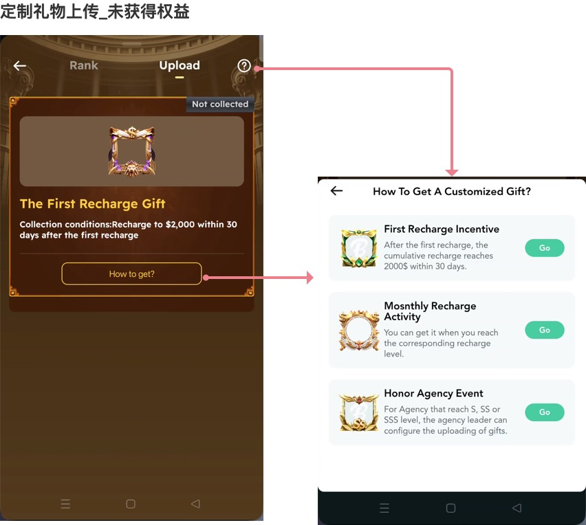

#### 4.3.1 页面定位与前置条件

用户从未获得权益，或曾有权益但权益已到期时，Upload统一进入未获得权益状态。当前版本的权益来源仅保留**月度充值活动**；原型中的首次充值激励和荣誉公会活动不再作为本期权益来源。

#### 4.3.2 页面字段

| 区域/字段 | 展示内容 | 业务含义/数据来源 |
|---|---|---|
| Rank/Upload | Upload选中 | 可在榜单和上传功能间切换 |
| 返回/问号 | 顶部入口 | 问号进入获取方式说明；返回状态恢复本次不处理 |
| 权益示意图 | 金色权益卡内的示意图 | 展示定制礼物权益，不解释为用户已经上传的礼物封面 |
| Not collected | 未获得权益状态文案 | 用户当前无有效定制礼物权益；不新增手动领取按钮 |
| 月度充值活动 | 当前唯一权益来源 | 当月活动有效充值金额达到US$2,000后，触发一次权益发放 |
| How to get? | 获取方式入口 | 进入月度充值活动获取说明；具体跳转目标本次不处理 |

#### 4.3.3 获取与发放规则

1. 月度累计和活动有效充值金额完全沿用充值活动PRD口径，按UTC+3自然月统计。
2. 同一用户当月活动有效充值金额达到 `US$2,000` 后，成功发放一次定制礼物权益并增加30天有效期。
3. 同一用户每个UTC+3自然月最多成功发放1次；重复达标不得重复增加天数。
4. 用户当前无有效权益或权益已到期时，从本次发放成功时间起计算30天。
5. 用户当前权益仍有效时，从原到期时间继续顺延30天。
6. 次月再次达标时形成新的权益发放记录，不复用上月发放记录；礼物业务身份和历史记录继续沿用。
7. 点击Go或刚达到门槛不等于权益已到账；以权益发放成功为准。发放失败、重试、补发幂等以及退款、撤销、冲正后的权益处理仍待确认。

#### 4.3.4 页面与状态衔接

1. 无有效权益时不开放礼物信息提交。
2. 权益成功发放后，页面切换至对应上传/修改状态，并展示新的权益到期时间或剩余天数。
3. 权益到期后，用户的定制礼物从礼物栏隐藏，Upload回到本节未获得权益状态。
4. 次月重新获得的是新的权益发放记录，但继续关联原定制礼物；不因重新获得权益自动创建第二个礼物。

#### 4.3.5 状态与异常

| 场景 | 处理口径 |
|---|---|
| 当月未达US$2,000 | 保持未获得权益引导 |
| 达标但权益尚未成功发放 | 不提前增加30天；发放延迟、重试、补发及提示仍待确认 |
| 当月重复达到或超过门槛 | 当月已成功发放过时不重复增加天数 |
| 曾有权益但已到期 | 礼物栏隐藏定制礼物，Upload展示未获得权益状态；历史礼物身份和记录保留 |
| 退款、撤销或冲正 | 是否追回权益、扣减天数或恢复当月发放资格，继续待确认 |

### 4.4 上传定制礼物——空状态

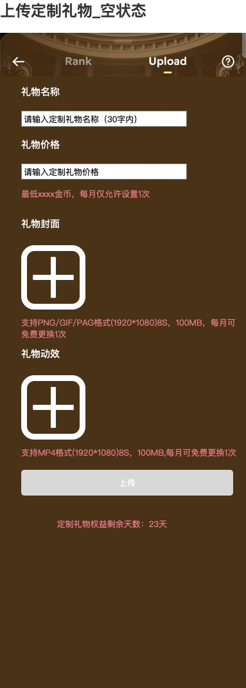

#### 4.4.1 页面定位与前置条件

原型标注已获得权益后的空表单，用于输入礼物名称、价格并选择封面、动效。当前礼物已有本月提交内容且满足该页进入条件时，对应4.6；仅有历史提交或权益到期后的入口见U02、U03。不默认把再次进入Upload理解成重新创建一个礼物。

#### 4.4.2 页面字段与输入规则

| 字段/控件 | 展示、输入或提示 | 来源与规则 |
|---|---|---|
| Rank/Upload、返回、问号 | Upload选中，顶部展示导航入口 | 跨页返回及问号落点见U12 |
| 礼物名称 | “请输入定制礼物名称（30字内）” | 用户填写；限制30字内，字符计数及名称合法性见U11 |
| 礼物价格 | “请输入定制礼物价格” | 用户填写金币价格；最低价格暂定200000金币，可设置更高价格，最高价及输入格式仍待确认 |
| 价格说明 | “最低200000金币，每月仅允许设置1次” | 最低价格为暂定值；首次设置占用当月1次，成功设置后在该自然月内锁定 |
| 礼物封面 | ＋号素材选择区 | PNG/GIF/PAG；原型标注1920×1080、8S、100MB；每月可免费更换1次 |
| 礼物动效 | ＋号素材选择区 | MP4；原型标注1920×1080、8S、100MB；每月可免费更换1次 |
| 上传 | 空表单中呈灰色 | 原型对比填完后呈蓝色；可点击条件及校验顺序见U11 |
| 定制礼物权益剩余天数 | “定制礼物权益剩余天数：23天” | 当前权益剩余时长的天数展示；23天为示例，取整及到期边界见U03 |

**素材规格边界：** 原型确实给出1920×1080、8S、100MB，不能继续写成“完全未提供规格”。但未说明这些数值是固定规格还是上限，也未说明静态PNG如何适用8S，因此不扩写“必须8秒”“不超过100MB”等校验，见U11。

#### 4.4.3 交互逻辑

1. 用户分别输入名称、金币价格，并通过封面、动效选择区添加素材。
2. 当前表单有输入及素材后，承接4.5的已填写未提交展示。
3. 名称、价格和素材约束按5.2、5.3、5.5定义；超长名称、最低价以下输入、错误格式等提示与拦截时点见U11。
4. 页面展示权益剩余天数；进入此页不重新开始计算权益有效期。
5. 用户离开、返回、选择素材取消后的草稿保留策略见U12，不新增草稿箱功能。

#### 4.4.4 状态与异常

| 场景 | 页面/业务处理 |
|---|---|
| 全部为空 | 按空状态原型显示输入占位和素材＋号，上传按钮灰色 |
| 部分已填写 | 保留当前已填字段的展示；按钮状态与具体校验见U11 |
| 全部示例内容已填写 | 展示4.5，不代表已提交或已生效 |
| 素材选择失败/格式不符 | 提示、素材保留及重选行为见U11 |
| 编辑期间权益到期 | 礼物栏隐藏且Upload回到未获得权益状态；当前未提交草稿是否保留、已打开页面能否继续提交仍待确认 |

### 4.5 上传定制礼物——已填写未提交

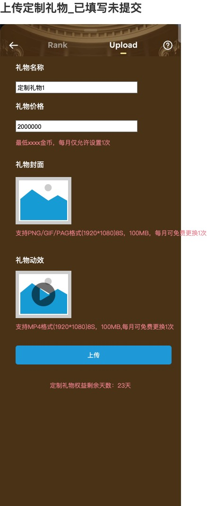

#### 4.5.1 页面定位与前置条件

用户已经在当前表单填写名称、价格，并选择封面和动效，但尚未提交。此状态用于检查当前填写内容和发起上传，不表示已创建可赠送礼物。

#### 4.5.2 页面字段

| 字段/控件 | 当前展示 | 数据来源/处理口径 |
|---|---|---|
| 礼物名称 | 示例“定制礼物1” | 当前输入内容；沿用30字内限制 |
| 礼物价格 | 示例2000000 | 当前填写的金币价格；不是最低价格或默认价格 |
| 封面缩略图 | 已选择的素材图 | 当前表单选择的封面；不能据此判定已提交成功 |
| 动效缩略图/播放标识 | 已选择素材，中央有播放图标 | 动效预览入口的图形；预览方式、失败和返回见U11 |
| 价格与素材说明 | 保留最低价、次数和规格说明 | 与4.4相同的业务约束，不因填完而取消 |
| 上传 | 蓝色按钮 | 发起当前表单提交；最终校验条件见U11 |
| 权益剩余天数 | 示例23天 | 当前权益剩余天数，见U03 |

#### 4.5.3 交互逻辑

**提交前**

1. 页面展示当前填写内容，用户可检查名称、价格和素材。
2. 此独立原型未展示确认弹窗。不能把4.6的价格二次变化弹窗直接改名为首次创建必弹窗。
3. 是否允许点击缩略图替换、动效如何播放，见U11；不能从播放图标扩写全屏播放器、音量或下载功能。

**发起上传与结果**

1. 点击上传发起当前内容提交。
2. 首次成功上传分别占用名称、封面和动效三个字段各自当月的1次免费机会；价格首次设置占用当月价格设置次数。实际扣款、次数消耗及提交成功的事务顺序仍见U06。
3. 提交成功后无需审核，礼物立即在定制礼物栏展示并可赠送，同时承接“已填写本月已提交”状态。返回、提示或留在原页的表现本次不处理。
4. 只有提交成功才切换可赠送内容；提交处理中继续使用旧内容，首次创建尚无旧内容时不得提前展示未成功内容。

#### 4.5.4 状态与异常

| 场景 | 当前需求边界 |
|---|---|
| 用户未点上传 | 内容仍是当前表单填写结果，不作为礼物生效依据 |
| 提交成功 | 无需审核，立即形成当前有效内容并在礼物栏展示可赠送；锁价、扣费和次数消耗的事务先后仍见U06 |
| 提交失败/超时 | 是否保留素材、是否重试、费用和次数是否恢复见U06、U11 |
| 用户连续点击上传 | 重复操作识别与是否只生成一次业务结果见U06 |
| 提交时权益失效或跨月 | 使用哪个权益及次数周期见U03、U08 |

### 4.6 上传定制礼物——已填写本月已提交

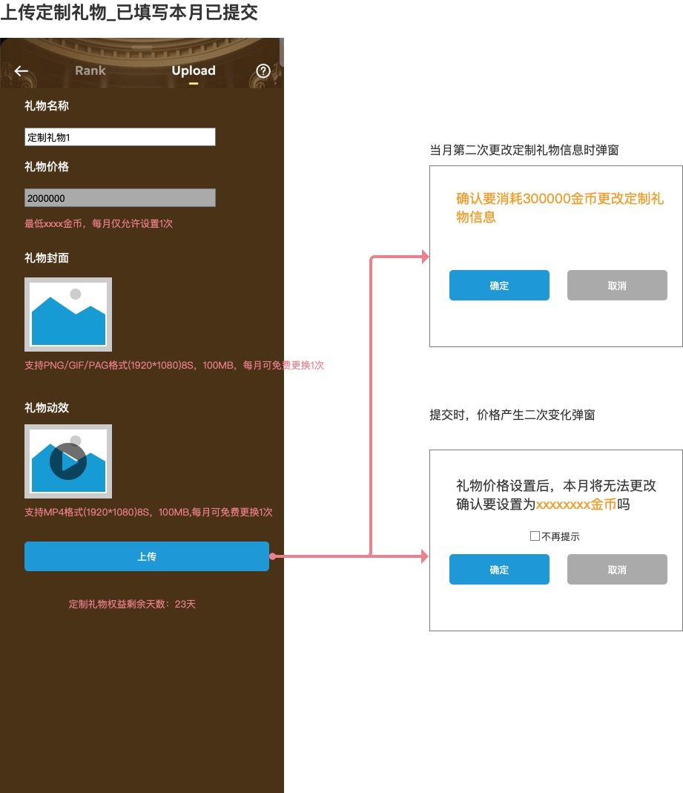

#### 4.6.1 页面定位与前置条件

用户当前礼物已有本月提交内容。页面用于查看现有内容并发起允许范围内的修改。原型右侧展示非价格信息付费更改和“价格二次变化”两个弹窗，但后者与最新确认规则冲突，本期不采用。

本状态下价格框按锁定状态处理：每个自然月只能设置或修改1次，成功设置后当月不可再次编辑或提交新价格；非价格信息的付费修改不得绕过锁价。

#### 4.6.2 页面字段与操作

| 字段/控件 | 当前展示 | 本状态特有规则 |
|---|---|---|
| 礼物名称 | 示例“定制礼物1” | 与封面、动效分别计算每自然月1次免费修改机会；首次成功上传已占用当月免费次数 |
| 礼物价格 | 示例2000000，输入区灰色 | 首次设置占用当月1次，设置后自然月内锁定；非价格信息付费修改不得绕过价格锁定 |
| 礼物封面 | 当前素材缩略图 | 单独计算每自然月1次免费修改机会；首次成功上传已占用当月免费次数 |
| 礼物动效 | 当前缩略图及播放标识 | 单独计算每自然月1次免费修改机会；首次成功上传已占用当月免费次数；规格与预览本次不处理 |
| 上传 | 蓝色提交按钮 | 本状态下承接信息更改动作，不另外增加“保存”“编辑”按钮 |
| 权益剩余天数 | 示例23天 | 修改与续期对有效期的影响见U03 |

#### 4.6.3 当月第二次更改定制礼物信息确认

**原型触发注释：**“当月第二次更改定制礼物信息时弹窗”。

| 元素 | 原型文案/含义 |
|---|---|
| 提示内容 | 确认要消耗300000金币更改定制礼物信息 |
| 确定 | 确认本次付费更改意愿；不代表已扣款成功或内容已生效 |
| 取消 | 不确认本次付费更改；弹窗关闭及表单保留方式见U12 |

- 300000金币是本情形的更改费用，不是礼物价格。
- 名称、封面、动效分别计次；首次成功上传分别占用各字段当月第1次免费机会。
- 任一实际变化字段当月免费次数已用时，本次提交进入付费修改；当月第二次以及第三次及以后每次付费修改均收取300000金币。非价格信息付费修改次数不设上限；同一次提交包含多个超额字段时合计只收取一次300000金币。
- 余额不足、扣款失败、扣款后提交失败、重复确认的处理见U06，不以自动退款或额度自动恢复作为已确认规则。

#### 4.6.4 原型中的价格二次变化弹窗（本期不采用）

**原型证据：** 独立原型标注“提交时，价格产生二次变化弹窗”。最新业务确认明确月内无法二次改价，因此该弹窗不进入本期有效交互流程，仅保留为被业务规则覆盖的原型证据。

| 元素 | 原型文案/含义 |
|---|---|
| 限制提示 | 礼物价格设置后，本月将无法更改 |
| 价格确认 | 原型文案“确认要设置为xxxxxxxx金币吗”；本期月内二次改价不展示该确认 |
| 不再提示 | 随失效弹窗一并不采用，不形成客户端偏好 |
| 确定/取消 | 不进入本期有效交互，不产生价格提交或回退分支 |

xxxxxxxx仅为原型中的占位表达，不是固定价格。

**最终规则：** 每个自然月只能成功设置或修改1次价格。月内已有成功价格后再次改价时，直接阻止价格变化，不展示“确认后继续改价”的路径；用户只能等到下一个自然月再次设置。

#### 4.6.5 交互顺序与状态

1. 用户对已有内容发起修改，点击上传。
2. 非价格信息按字段分别判断免费次数；字段免费次数已用时进入付费修改确认。价格独立执行自然月锁定，不纳入300000金币付费修改。
3. 本自然月已成功设置价格后，如检测到价格变化，直接阻止该价格提交并恢复当前生效价格；不展示可确认继续改价的弹窗。
4. 非价格信息仍可按免费或付费规则继续修改，不因价格锁定而被禁止。
5. 修改提交处理期间继续使用旧内容；修改成功后客户端立即切换新内容。礼物身份和历史记录继续沿用，上周榜金额与排名不因修改而重算；历史榜图文显示当前还是周期内容仍待确认。

#### 4.6.6 异常与边界

| 场景 | 待明确处理 |
|---|---|
| 同时修改名称、封面、动效 | 分别判断各字段免费次数；只要任一实际变化字段的免费次数已用，本次提交合计收取一次300000金币，不按超额字段数量叠加 |
| 封面免费次数已用，动效未用 | 封面命中付费条件，动效使用自身免费机会；本次合并提交收取一次300000金币 |
| 没有实际变化仍点上传 | 不计修改次数、不产生修改费用；提交反馈本次不处理 |
| 修改费用余额不足 | 是否拦截、提示及充值后是否继续原操作，见U06 |
| 同一修改重复点击/结果未返回 | 是否合并结果、如何避免重复扣款和消耗次数，见U06 |
| 同时改价格与非价格信息 | 价格变化直接阻止并恢复当前生效价格；非价格字段是否可单独继续提交及其反馈方式见U06、U12 |
| 权益到期、跨月或其他端已修改 | 按哪个时点判断资格及次数见U03、U06、U08 |

## 5. 共用业务规则

### 5.1 权益获取、生效与重新获得

| 规则项 | 已确认规则 | 剩余边界 |
|---|---|---|
| 唯一权益来源 | 仅保留月度充值活动；首次充值激励和荣誉公会活动不属于本期权益来源 | 无 |
| 达标条件 | 同一用户当月活动有效充值金额达到US$2,000 | 活动有效充值金额及UTC+3自然月口径沿用充值活动PRD |
| 权益结果 | 每次成功发放增加30天定制礼物权益 | 发放失败、重试与补发幂等仍待确认 |
| 自然月频控 | 同一用户每个UTC+3自然月最多成功发放1次 | 以成功发放记录为准；当月重复达标不得重复增加天数 |
| 无有效权益 | 从本次发放成功时间起计算30天 | 剩余天数取整与到期精确时点仍待确认 |
| 当前权益有效 | 在原到期时间基础上顺延30天 | 次月达标形成新的权益发放记录，不复用上月记录 |
| 权益到期 | 礼物从定制礼物栏隐藏，Upload进入未获得权益状态 | 编辑中到期、未提交草稿处理仍待确认 |
| 礼物延续 | 次月重新获得新权益时，继续关联同一定制礼物身份和历史记录 | 一份权益可关联多少礼物仍待确认 |
| 退款/撤销/冲正 | 尚未确认 | 是否追回权益、扣减天数或恢复当月发放资格不得擅自设定 |

原脑图中的“定制头像权益”为笔误，本文统一使用“定制礼物权益”。权益获得、价格月内次数和名称/封面/动效免费次数是不同业务对象，不得互相替代。

### 5.2 礼物价格

| 规则项 | 已确认规则 | 剩余边界 |
|---|---|---|
| 金额单位 | 礼物价格以金币表示 | 数字格式、整数/小数范围和最高价仍待确认 |
| 最低价 | 最低价格暂定200000金币，用户可设置更高价格 | “暂定”不得省略；正式值变更需再次确认 |
| 月内次数 | 每个自然月仅有1次价格设置/修改机会；首次设置占用当月1次 | 实际消耗时点仍见U06 |
| 设置后限制 | 价格成功设置后在当前自然月内锁定，月内任何二次改价均不允许提交；非价格信息付费修改不得绕过锁定 | 已确认，无例外付费改价路径 |
| 次月重新设置 | 次月获得新权益后，可重新设置价格；新价格成功生效后替换旧价格 | 新价格成功前继续使用旧价格 |
| 付费信息修改 | 300000金币付费修改只适用于非价格礼物信息 | 不产生额外改价机会 |

**U04最终结论：** 每个自然月只能成功设置或修改1次价格。价格成功设置后当月锁定；月内再次改价直接禁止，不存在提示后放行、付费改价或例外覆盖。次月可重新设置，新价格成功后替换旧价格。

**事务边界：** 价格次数在何时消耗、失败时是否恢复、重复提交如何合并，继续由U06确认。

### 5.3 名称、封面与动效修改

| 对象/情形 | 已确认规则 | 剩余边界 |
|---|---|---|
| 礼物名称 | 每个自然月独立拥有1次免费机会 | 首次成功上传占用当月第1次；字符校验本次不处理 |
| 礼物封面 | 每个自然月独立拥有1次免费机会 | 首次成功上传占用当月第1次；素材校验本次不处理 |
| 礼物动效 | 每个自然月独立拥有1次免费机会 | 首次成功上传占用当月第1次；素材校验本次不处理 |
| 无实际变化提交 | 不计修改次数，不产生修改费用 | 如何提示本次不处理 |
| 当月第二次修改某字段 | 该字段免费机会已用时，本次提交收费300000金币 | 扣费时点、失败恢复见U06 |
| 第三次及以后非价格修改 | 允许继续付费修改，不限制次数；每次提交仍收费300000金币 | 一次提交形成一次付费修改，不随超额字段数量叠加 |
| 同时修改多个字段 | 各字段分别判断自身免费次数；任一实际变化字段超额即命中付费 | 同一次提交包含一个或多个超额字段，合计只收费一次300000金币 |
| 礼物价格 | 不属于本节付费修改范围 | 独立遵循5.2自然月锁定规则 |
| 修改生效 | 处理期间继续使用旧内容；修改成功后客户端立即切换新内容 | 成功判定、扣费、计次原子性见U06 |

#### 5.3.1 修改决策表

| 用户动作 | 免费/收费 | 修改次数处理 | 价格影响 |
|---|---|---|---|
| 首次创建并成功提交 | 名称、封面、动效分别使用自身当月免费机会 | 三个字段各计1次 | 首次价格设置占用当月1次；成功设置后锁定 |
| 首次成功上传后，本月再次实际修改某个非价格字段 | 该字段首次上传已占用当月免费机会，本次收费300000金币 | 该字段进入当月第2次操作记录 | 不增加价格修改机会 |
| 某字段当月第三次及以后实际修改 | 允许付费修改，次数不限；本次提交收费300000金币 | 继续记录该字段付费修改次数 | 不得修改价格 |
| 同时修改多个字段 | 各字段分别判断免费或付费；只要任一实际变化字段超额，本次提交合计收费一次300000金币 | 每个有实际变化的字段分别计次 | 价格独立处理 |
| 无实际变化提交 | 不收费 | 不计次 | 不触发改价 |
| 失败、取消、重复提交 | 扣费和恢复规则见U06 | 计次、恢复及幂等见U06 | 锁价及恢复见U06 |

### 5.4 统计与时间字段

以下为业务口径，不表示新增前台列、筛选或后台页面字段。

| 业务字段 | 定义/统计方式 | 展示或使用位置 | 缺口 |
|---|---|---|---|
| 礼物本周赠送金币金额 | 按UTC+3自然周汇总归属于该定制礼物的普通礼物成功赠送金币金额 | 礼物栏降序排序 | 同额先达到者靠前；零赠送按权益获得时间升序；退款撤销沿用普通礼物规则 |
| 用户对某礼物本周赠送金币数量 | 按UTC+3自然周汇总同一用户成功赠送同一定制礼物的金币数量 | 所选礼物榜一头像 | 同额时先达到该金额者为榜一；无数据表现本次不处理 |
| Rank周期赠送金币总金额 | 按UTC+3自然周汇总同一定制礼物的普通礼物成功赠送金币金额 | Rank本周榜/上周榜的右侧数值与降序排名 | 本周实时计算；上周排名与金额冻结；同额先达到者靠前；零赠送按权益获得时间升序 |
| 月度最高活动有效充值金额 | 按充值活动PRD分别计算定制礼物所属用户本月、上月的活动有效充值金额，取两个月中的最高值 | 礼物边框 | 金额变化后实时重算；低于US$2,000为基础默认样式，达到US$2,000为普通档，达到US$3,000为高级档；月切时按新的本月/上月最高值重新匹配，全部存量礼物同步更新 |
| 权益剩余天数 | 当前权益到期时间与当前时间的剩余时长，以天展示 | Upload底部 | 每次发放增加30天；取整及不足一天的展示仍待确认 |
| 月内字段修改次数 | 名称、封面、动效三个字段分别记录当月免费及付费修改次数 | 上传及付费判断 | 首次成功上传分别计1次；实际消耗时点与失败恢复见U06 |
| 价格设置次数 | 当前自然月已消耗的唯一价格设置/修改机会 | 价格可修改性 | 首次成功设置即占用当月次数；月内再次改价直接禁止；并发、失败恢复和实际落账时点见U06 |
| 更改费用 | 非价格信息付费修改每次提交收取300000金币；第二次及第三次以后相同；同一提交多个超额字段只收一次 | 4.6付费确认 | 扣款时点、失败恢复、重复提交与幂等仍见U06 |

**统计隔离：** 更改费用不属于赠送某个礼物的金币金额，不能仅因同为金币就在礼物栏排序或榜一判断中混算。具体送礼交易的统计有效性见U09。

### 5.5 素材与输入规则

| 项目 | 原型明确值 | 未明确的执行含义 |
|---|---|---|
| 名称长度 | 30字内 | 字符计数、表情、空格、空字符串、重复名称及内容限制见U11 |
| 封面格式 | PNG/GIF/PAG | 动态封面预览及各格式的校验方式见U11 |
| 动效格式 | MP4 | 播放方式、音频、预览失败和文件兼容性见U11 |
| 分辨率 | 封面与动效均标注1920×1080 | 固定值、推荐值还是上限，以及各格式如何执行校验见U11 |
| 时长 | 8S | 固定时长还是最长8秒；PNG是否适用见U11 |
| 大小 | 100MB | 最大体积还是示例规格；按单文件还是合计见U11 |
| 表单完成 | 空状态灰色上传，已填写状态蓝色上传 | 必填集合、失败时提示、何时拦截与重复点击处理见U06、U11 |

### 5.6 定制礼物边框样式

#### 5.6.1 充值金额定义

定制礼物边框使用的“充值金额”不直接取支付订单金额、消费订单标价或礼物面值，而是沿用《充值活动产品需求文档（PRD）》第5章的**活动有效金币**口径。活动有效金币由以下两类事件构成：

1. **非币商用户的有效金币到账**：通过接收方身份及金币来源校验、并且金币实际到账成功的事件，按实际到账金币计入，计入系数为1。
2. **币商用户的指定金币消耗**：币商作为实际消耗方，且实际成功扣减金币的行为，按指定场景和系数计入：游戏消费×1、赠送非幸运礼物×1、赠送幸运礼物×0.1。

边框统计使用的原始金额为活动有效金币；如边框档位配置使用美元金额，则按 `88,888活动有效金币 = US$1` 换算，使用未向下取整的计分美元值进行档位匹配。页面将计分美元值向下取整后的展示值，不得反向作为边框匹配依据。

#### 5.6.2 允许计入的充值及消费行为

| 行为 | 是否纳入边框充值金额 | 计入口径 |
|---|---|---|
| 官方应用内充值 | 是 | 非币商用户实际到账金币×1 |
| 第三方充值链接充值 | 是 | 非币商用户实际到账金币×1 |
| 普通用户通过币商/代理购买金币 | 是 | 普通用户实际获得并到账的金币×1；币商卖方收币不计入 |
| 非币商用户提现余额/可提现资产转金币 | 是 | 本人实际到账金币×1 |
| 非币商用户钻石兑换金币 | 是 | 本人实际到账金币×1 |
| 运营后台增加金币 | 有条件计入 | 接收方为非币商，币种为金币、方式为增加、类型命中柚子/vodafone/shamcash/差价补偿白名单且操作成功时，按实际到账金币×1计入 |
| 币商账号通过任何方式接收/增加金币 | 否 | 币商身份排除优先于来源白名单；金币可到账，但不形成活动有效金币 |
| 币商玩游戏消耗金币 | 是 | 实际成功扣减金币×1，归入实际消耗金币的币商 |
| 币商赠送非幸运礼物 | 是 | 实际成功扣减金币×1，归入实际消耗金币的币商 |
| 币商赠送幸运礼物 | 是 | 实际成功扣减金币×0.1；不按礼物面值、接收方所得、幸运返奖或中奖金额计算 |
| 币商其他消费 | 否 | 不扩展计入范围 |
| 失败、取消、未实际扣款 | 否 | 不形成活动有效金币 |
| 幸运礼物返币、活动奖励、运营补偿、测试加币、人工调账等其他增加 | 否 | 不形成活动有效金币 |

实时事件按成功到账时间或成功消费时间归入UTC+3周期；同一业务事件只能计入一次。退款、撤销、回滚、冲正必须关联原事件，按原计入系数反向调整，不改用接收方所得、游戏结果或返奖金额重算。

#### 5.6.3 边框档位匹配

**统计主体：** 定制礼物所属用户。每件定制礼物读取其所属用户的活动有效充值金额，不读取送礼用户、收礼用户、礼物价格、礼物被赠送金额或Rank金额。

**匹配金额公式：**

`边框匹配金额 = max（所属用户本月活动有效充值金额，所属用户上月活动有效充值金额）`

| 边框匹配金额 | 对应结果 | 档位边界 |
|---|---|---|
| 低于US$2,000 | 基础默认样式 | 不属于普通档或高级档 |
| 达到US$2,000且低于US$3,000 | 普通档位边框 | 含US$2,000，不含US$3,000 |
| 达到US$3,000 | 高级档位边框 | 含US$3,000及以上 |

档位判断以5.6.1定义的未向下取整计分美元值为准。按现有换算，US$2,000对应177,776,000活动有效金币，US$3,000对应266,664,000活动有效金币；美元门槛为产品规则，金币值是按当前换算口径得出的等价值，不替代美元规则。

#### 5.6.4 实时升降档与存量展示

1. 活动有效充值金额因成功到账、成功消费、退款、撤销、回滚或冲正发生变化后，实时重新计算所属用户的边框匹配金额与档位。
2. 匹配金额跨越档位边界时立即升级或降级，不等待次日，也不等到下一个自然月。
3. UTC+3自然月切换时，以新的本月累计值和刚结束月份的累计值重新取最高值；旧的“上月”退出两月窗口后不再参与计算。
4. 档位结果作用于该用户全部存量定制礼物。已经展示在礼物栏、Rank或后台列表/详情中的礼物均同步使用当前边框，不要求重新创建或再次提交礼物。
5. 边框变化只改变展示样式，不改变礼物身份、名称、价格、封面、动效、赠送记录、Rank金额、历史排名或定制礼物权益有效期。

### 5.7 后台定制礼物管理

本模块来自脑图“后台→定制礼物管理”。后台范围仅保留**定制礼物管理**：查询用户已上传的定制礼物、查看详情、导出当前筛选结果，以及按已确认权限发起下架或恢复展示。其他后台模块不属于本期交付范围。

#### 5.7.1 对应原型与模块边界

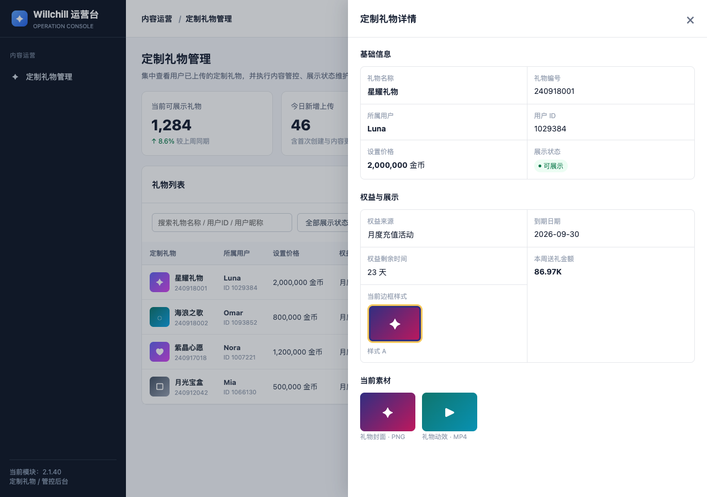

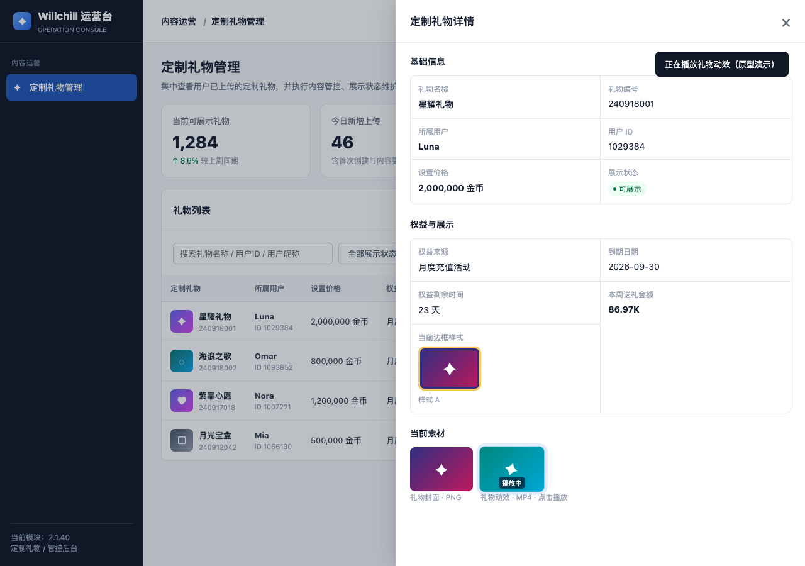

后台原型仅保留一个“定制礼物管理”导航入口。列表“查看”打开详情抽屉；列表“下架”或“恢复”打开确认弹窗。原型中的用户、礼物、编号、金额、日期与统计值均为展示样例，不作为正式配置。

#### 5.7.2 定制礼物列表

列表支持搜索、筛选、查询、重置和导出。权益来源筛选及列表数据只使用一个枚举值：`月度充值活动`；后台不新增其他权益来源选项。

| 筛选/字段 | 原型可见内容 | 需求口径 |
|---|---|---|
| 搜索 | 礼物名称、用户ID、用户昵称 | 在当前后台列表范围内检索；匹配规则和分页未定义 |
| 展示状态 | 全部展示状态、可展示、已下架、权益到期 | 成功提交后为可展示；权益到期后客户端隐藏；后台下架/恢复成功后客户端立即生效 |
| 权益来源 | 全部权益来源、月度充值活动 | 本后台字段/筛选的唯一业务枚举为月度充值活动 |
| 日期筛选 | 日期输入框 | 原型未明确该日期对应到期日期、更新时间或其他日期，字段语义待确认 |
| 查询/重置/导出 | 查询、重置、导出 | 查询与重置作用于当前筛选条件；导出范围和字段是否与列表一致待确认 |
| 定制礼物 | 礼物名称及纯数字编号 | 编号按纯数字展示；示例 `240918001`、`240918002`、`240917018`、`240912042` 仅为样例格式 |
| 所属用户 | 用户昵称及用户ID | 展示当前礼物所属用户，不等同于送礼对象或榜一送礼用户 |
| 设置价格 | 金币价格 | 展示当前礼物设置价格；价格锁定和变更规则沿用4.4—4.6、5.2 |
| 到期日期 | `YYYY-MM-DD`日期 | 与“权益剩余”并列展示具体到期日期；日期来源、时区和到期后的处理见U03 |
| 权益剩余 | 剩余天数或已到期 | 用于运营快速判断权益状态；取整口径见U03 |
| 当前边框样式 | 图片缩略预览 | 列表展示所属用户按5.6实时匹配的当前边框；存量礼物升降档后同步更新 |
| 展示状态 | 可展示、权益将到期、已下架等标签 | 成功提交无需审核并立即可展示；权益到期时客户端隐藏；后台操作成功后立即切换客户端展示状态 |
| 本周送礼金额 | 定制礼物本周送礼金额 | 沿用5.4礼物送礼金额口径，不包含修改费用 |
| 最近更新 | 最近一次更新日期/时间 | 更新事件范围及失败提交是否更新见U06/U08 |
| 操作 | 查看、下架；已下架记录可恢复 | 下架/恢复的触发权限、客户端可见性、历史统计影响见U07/U08；原型未提供详情内管理操作 |

#### 5.7.3 定制礼物详情与操作边界

点击列表“查看”打开详情抽屉。详情展示当前礼物的识别信息、所属用户、价格、权益来源、到期日期、剩余天数、当前边框样式图片、展示状态及本周送礼金额；点击礼物动效预览可播放当前礼物动效。

当前原型明确的详情约束：

- 当前边框样式必须以图片预览展示，不用纯文字标签替代。
- 详情不展示“变更记录”“管理操作”“查看完整变更记录”。
- 详情抽屉用于查看，不新增独立编辑、审核或价格修改入口。
- 详情中的到期日期与权益剩余同时保留，不能用剩余天数替代具体日期。
- 点击“礼物动效”预览区播放当前礼物动效；播放中再次点击暂停。该动作只用于查看当前素材，不新增编辑、替换、下载或审核入口。

*图：详情抽屉中点击礼物动效后的播放状态；图中“播放中”仅表示原型播放态，非素材审核或展示生效状态。*

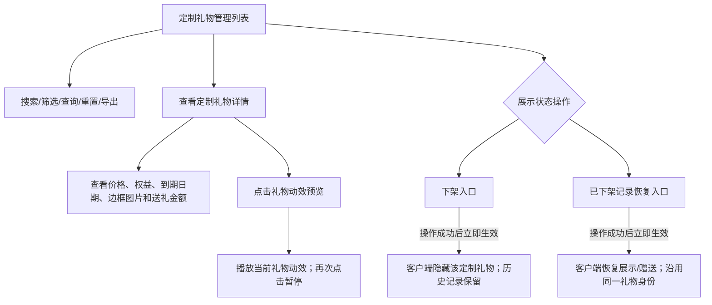

定制礼物提交和内容修改无需素材审核；成功提交或修改后客户端立即生效。后台下架/恢复操作成功后也立即改变客户端展示状态。仍待确认：后台操作角色与数据权限、下架/恢复是否需要理由或二次确认、操作审计、恢复条件、列表分页与导出范围，以及后台下架对历史榜单和送礼统计的影响。

### 5.8 提交一致性、失败与重复操作

这是需要补齐的规则清单，不是已确定的退款或补偿方案。

| 关键场景 | 需要得到唯一答案 | 关联待确认项 |
|---|---|---|
| 非价格信息付费确认弹窗 | 只表示同意，还是此刻即扣钱/扣次数 | U06 |
| 内容提交成功 | 提交内容、有效内容和费用是否同时完成 | U06、U07 |
| 余额不足/扣款失败 | 是否停止修改，如何提示，是否消耗次数 | U06 |
| 已扣款但内容失败 | 退款、待重试还是其他处理；何时恢复次数 | U06 |
| 免费修改失败 | 免费次数是否已用、是否恢复以及恢复时点 | U06 |
| 重复点击/重试 | 同一次业务修改如何识别，如何避免重复付费和计次 | U06 |
| 多端同时修改 | 哪个提交有效，次数、价格和费用如何统一 | U06 |
| 权益到期或跨月 | 使用进入表单还是提交结果时的权益与周期 | U03、U06、U08 |
| 提交结果未知 | 用户重进看到什么，如何获知实际结果 | U06、U12 |

## 6. 待确认决策表

以下表格保留人工“确认方案”原文，并记录本轮落实状态。`部分落实`表示已将确定规则写入正文，但原问题仍有未回答边界；`本次不处理`不等于规则已确认。

| 编号 | 待确认主题 | 必须明确的问题 | 影响模块 | 确认方案 | 落实状态与剩余边界 |
|---|---|---|---|---|---|
| U01 | Rank展示映射 | 排行主体已确认为定制礼物；大图、名称和右侧数值分别对应礼物封面、礼物名称及对应周期赠送金币总金额；小圆头像与名称已确认为对应周期内赠送该礼物金额最高的榜一用户。仍需确认Banner进入是否依赖已选礼物及排名数量范围 | 2.3、4.2 | 小圆圈头像为本周、上周赠送该礼物榜一用户的头像以及名称 | **部分落实**：头像和名称已回写；Banner是否依赖已选礼物、排名数量范围仍待确认 |
| U02 | 权益来源、数量与归属 | 脑图2000美元条件与首充30天规则的关系；月充x数值和币种；有效充值来源、汇率及退款影响；多来源能否叠加；一份权益对应多少礼物；公会权益归属、名额及身份/等级变化；发放、重复达标和到账处理 | 2.1、2.2、4.3、5.1 | 来源只有当前的月充活动逻辑，去掉首冲和荣誉公会活动 | **部分落实**：来源已收敛为月度充值活动，并按已确认规则写入US$2,000、30天和每自然月1次；一份权益对应礼物数量、发放失败/补发幂等及退款处理仍待确认 |
| U03 | 权益生命周期 | 有效天数、剩余天数取整；获得即计时原节点中的“定制头像”是否笔误；到期后的入口、编辑与赠送状态；编辑中到期如何处理；次月重新获得是续期还是新权益；未使用权益是否保留 | 2.4、3.2、4.3—4.6、5.1 | 定制头像为笔误；到期后定制礼物栏不再展示用户的定制礼物；入口变更为未获得定制礼物状态；次月重新获得是新权益。 | **部分落实**：术语、到期隐藏、入口和新权益记录已回写；剩余天数取整、到期精确时点、编辑中到期及草稿处理仍待确认 |
| U04 | 定价与锁价 | 最低金币价、输入格式与范围；首次设置是否占月内1次；锁定周期按自然月还是设置后一个月；“提交时价格产生二次变化”含义；与本月不可更改如何兼容；次月改价资格与旧价关系 | 3.3、4.4—4.6、5.2 | 原确认：最低价格暂定200000金币；首次设置占用月内1次；锁定周期按自然月；提交时价格产生二次变化为本月已修改价格后再次修改；次月新价格替换旧价格。**后续确认替代：每个自然月只能改1次价格，月内无法二次改价。** | **已落实**：首次设置/修改占用当月唯一次数，成功后当月锁定；再次改价直接禁止；次月新价格成功后替换旧价格。最高价、输入格式及U06事务时点仍待确认 |
| U05 | 修改次数与定价 | 每月免费1次按字段独立还是共用；名称如何计次；首次上传、无变化提交算不算；脑图每次付费x与免费1次的适用范围；第二次300000是否正式值；第三次以后能否修改及费用；原始材料高级用户月内3次是否采用；同一提交多个超额字段如何收费 | 3.3、4.6、5.3 | 每月免费1次按字段独立；首次上传算作1次，无变化提交不算；第二次及第三次以后每次付费修改均为300000金币；付费修改礼物信息（不包含价格）不限制次数；同一次提交修改多个超额字段合计只收一次 | **已落实**：字段独立计次，首次上传计次，无变化不计；任一字段超额后每次提交固定收取300000金币，同次提交不按超额字段数量叠加；原高级用户月内3次限制不采用 |
| U06 | 扣款、次数与提交结果 | 何时扣钱、锁价、消耗次数；余额不足、上传失败、扣款成功但修改失败怎么处理；重复点击、结果未知、多端修改的同一业务结果判定；取消及重试后费用/额度如何处理 | 3.2、3.3、4.5、4.6、5.8 |  | **待确认**：人工方案为空，正文不补默认事务规则 |
| U07 | 生效及后台范围 | 提交后何时可赠送；是否审核；修改期间使用旧内容还是新内容；后台具体功能、角色与操作权限；下架/恢复是否需要理由与审计；操作后的客户端生效时点；本次后台HTML已作为页面结构与字段事实来源，但不替代正式权限和生效规则 | 2.4、3.2、4.1、4.5、4.6、5.7 | 提交后即可在礼物栏展示可赠送，无需审核；修改期间使用就内容；操作后的客户端立即生效。 | **部分落实**：按语义将“就内容”落实为“旧内容”；成功提交/修改及后台操作后立即生效。后台角色、权限、理由和审计仍待确认 |
| U08 | 周期与历史 | 时区、周/月起止；Refresh的含义；上周榜是否冻结；同额排序；无赠送礼物的排序；改名改图改价、续期和到期后是否延续同一礼物及历史图文；周期边界与撤销统计 | 2.3、4.1、4.2、5.4 | 时区按：UTC+3，按自然周；上周榜单需要冻结；同额先达到者靠前；无赠送礼物的排序按获得权益的时间升序排序；改名改图改价、续期和到期后延续同一礼物及历史图文； | **部分落实**：周口径、上周金额/排名冻结、同额、零赠送及礼物身份延续已回写；同时达到、权益时间相同、Refresh含义及历史榜图文展示当前或周期内容仍待确认 |
| U09 | 赠送成功与金币统计 | 是否完全沿用已有普通送礼规则；对象、数量、送礼与收礼资格；扣费与收礼结果；统计成功时点、价格与数量口径；失败、重复和撤销是否扣回排名贡献 | 3.2、4.1、5.4 | 完全沿用已有普通送礼规则； | **部分落实**：正文统一引用系统现有普通礼物规则；仍需绑定权威规则文档/版本，避免研发与测试引用不同口径 |
| U10 | 边框主体、月口径与档位 | 本月与上月分别按什么主体统计活动有效充值金额；充值活动PRD已明确的有效金币来源、允许计入行为、计入系数、88,888金币兑US$1及UTC+3自然月周期直接沿用；两个月取最高值后的档位、未达档默认样式、月切换、升降档生效和存量礼物展示 | 4.1、5.4、5.6 | 主体为定制礼物所属用户；低于US$2,000显示基础默认样式，达到US$2,000显示普通档，达到US$3,000显示高级档；金额变化后实时升降档；月切时按新的本月/上月最高值重新匹配；全部存量礼物同步更新 | **已落实**：金额主体、公式、三段档位、边界包含关系、实时升降档、月切重算和存量展示已回写；金额定义继续完整沿用充值活动PRD |
| U11 | 表单与素材校验 | 30字计数和名称合法性；必填项、格式校验及提示；1920×1080、8S、100MB是固定值还是上限；PNG时长含义；预览、重选、素材失败处理 | 4.4—4.6、5.5 | 无需处理 | **本次不处理**：不等于已确认，现有原型描述保留 |
| U12 | 页面返回与提示 | 各页返回与问号落点；Go目标页；获取方式为页面还是弹层；空态、无榜一及失败提示；草稿与取消后内容保留；不再提示的范围；提交结果反馈；重新进入Rank是否重置为本周；原型月充英文错拼的正式文案；是否另出阿语用户文案 | 4.1—4.6、6.1 | 无需处理 | **本次不处理**：不等于已确认，正文不新增页面返回与提示规则 |

### 6.1 原始需求材料的采用边界

脑图“原始需求材料”中还包含“高级用户1个月内更换3次礼物样式”“付费获得更换权益”“一个月内不可更改价格”以及“翻译为阿语”等描述。

- “高级用户1个月内更换3次”已被人工确认的“非价格礼物信息可不限次数付费修改”替代，不再作为次数上限；第二次及第三次以后每次付费提交均收取300000金币，同次提交多个超额字段只收一次。
- 自行上传动画、命名和定价已落实到4.4—4.6。
- 最低价格暂定为200000金币；每个自然月只有1次价格设置/修改机会，成功后当月锁定，月内无法二次改价。
- “翻译为阿语”是原始文字中的翻译要求，不据此推导App端可切换语言、自动翻译礼物名称或新增阿语输入限制。本次交付中文PRD；是否另出阿语用户文案见U12。

## 7. 材料对照与评审状态

### 7.1 原型与正文对照

| 原型文件 | 对应章节 | 承接内容 |
|---|---|---|
| 定制礼物全交互流程.jpg | 3.1—3.3 | 整体入口与页面关系、并列弹窗与未确认衔接 |
| 定制礼物栏.jpg | 4.1 | 分类、Banner、榜一头像、礼物列表与赠送入口 |
| 定制礼物排行榜.jpg | 4.2 | Rank/Upload、本周/上周、列表构成与Refresh |
| 定制礼物上传_未获得权益.jpg | 4.3 | 权益卡、问号、How to get；原型中的三种获取方式仅作页面证据，当前业务只保留月度充值活动，首充与荣誉公会已移除 |
| 上传定制礼物_空状态.jpg | 4.4 | 字段占位、规格、价格限制、上传及剩余天数 |
| 上传定制礼物_已填写未提交.jpg | 4.5 | 填写内容、素材缩略图和提交边界 |
| 上传定制礼物_已填写本月已提交.jpg | 4.6 | 已有内容和非价格信息第二次付费；原型“价格二次变化”弹窗已被最新锁价规则覆盖，本期不采用 |
| 后台原型/定制礼物管理后台.html | 5.7 | 定制礼物管理列表、详情、筛选、导出及展示状态操作 |
| 后台原型/定制礼物管理后台-定制礼物管理.png | 5.7.1、5.7.2 | 定制礼物管理列表完整导出图 |
| 后台原型/定制礼物管理后台-定制礼物详情.png | 5.7.1、5.7.3 | 定制礼物详情抽屉完整导出图 |
| 后台原型/定制礼物管理后台-礼物动效播放.png | 5.7.3 | 定制礼物详情内点击动效后的播放状态导出图 |

### 7.2 与业务建模稿的处理差异

| 原建模问题 | 本PRD采用方式 |
|---|---|
| 已提交直接连接可赠送 | 已按人工确认修正为“成功提交后无需审核，立即展示并可赠送”；处理中仍使用旧内容 |
| Rank被定义为单礼物送礼用户榜 | 已修正为按所选周期对不同定制礼物的成功赠送金币总金额降序排名；礼物栏排序、榜一头像与Rank页面分别定义，未确认的附属展示映射保留U01 |
| 确认弹窗即扣钱、扣额度或锁价 | 确认意愿与业务结果分开，实际生效时点统一保留U06 |
| 权益和礼物写死一对一 | 次月达标形成新的权益发放记录，但继续关联同一定制礼物身份；一份权益对应礼物数量仍保留U02 |
| 泛化免费/付费修改次数 | 名称、封面、动效按字段独立计次；第二次及第三次以后每次付费提交固定300000金币，付费次数不限，同次提交多个超额字段只收一次 |
| 原型价格二次变化弹窗 | 保留为原型证据，但最新规则明确月内无法二次改价，因此不进入本期有效流程 |
| 素材规格遗漏 | 补回1920×1080、8S、100MB，保留固定值/上限解释的缺口 |
| 后台定制礼物管理此前未落入PRD | 将后台“定制礼物管理”HTML及列表/详情导出图作为5.7原型证据，写入字段与操作边界；未确认的权限、生效和历史影响继续保留U07/U08 |

### 7.3 当前评审结论

人工确认的权益来源与30天规则、到期隐藏、提交即生效、字段独立修改、价格每自然月仅1次且月内禁止二次改价、UTC+3自然周榜单、普通礼物赠送口径及U10边框规则已按关联章节回写。U06事务与幂等仍未闭环，U11/U12仅标记本次不处理，**因此本稿仍是评审稿，不是研发冻结版。**

后续明确规则时，应同时更新对象口径、相关页面、共用规则、流程分支及待确认表，不能只删除待确认问题而保留图中的旧口径。
