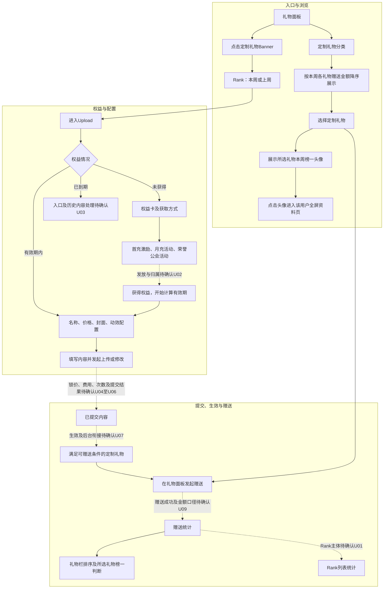
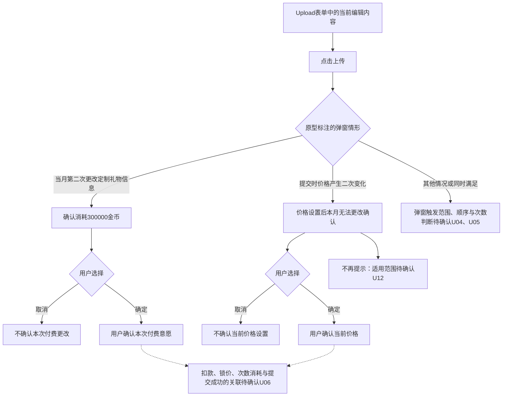
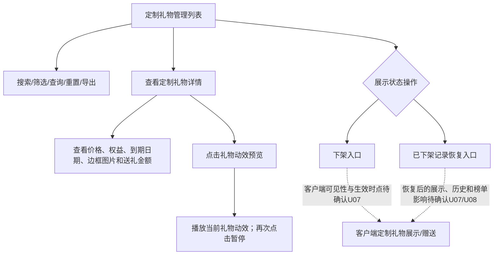

# 定制礼物需求文档

> 版本：2.1.40　｜　状态：评审稿，含待确认规则。
>
> 本文结合当前《定制礼物需求.xmind》、指定目录中的独立原型与全交互图，以及业务建模和逻辑审查结果编写。脑图定义业务规则，原型补充页面及交互；两者冲突时列入待确认，不自行设定优先级。建模稿中已被审查指出的推断，不作为已确认需求继承。

## 1. 需求范围

### 1.1 业务目标

为满足定制权益条件的用户提供礼物名称、价格、封面和动效的配置能力；在礼物栏增加定制礼物分类，提供定制礼物排行榜入口、所选礼物榜一用户展示，以及按本月与上月有效充值金额中的最高值匹配边框样式。

### 1.2 模块与阅读索引

| 模块 | 页面/规则范围 | 正文位置 | 当前状态 |
|---|---|---|---|
| 定制礼物栏 | 分类、顶部Banner、所选礼物榜一头像、礼物排序与赠送入口 | 4.1 | 已按原型描述；空态、赠送口径待确认 |
| 定制礼物排行榜 | Rank/Upload、本周/上周、榜单展示、刷新提示 | 4.2 | 页面已描述；排行主体待确认 |
| 未获得权益 | 权益卡、How to get、问号、获取方式 | 4.3 | 已按原型描述；发放与归属规则待确认 |
| 上传空状态 | 名称、价格、封面、动效、上传按钮、剩余天数 | 4.4 | 已按原型描述；规格与校验边界待确认 |
| 已填写未提交 | 内容展示、上传动作、提交结果边界 | 4.5 | 已按原型描述；生效与失败处理待确认 |
| 已填写本月已提交 | 内容修改、收费确认、价格变化确认 | 4.6 | 已按原型描述；次数、锁价与费用处理待确认 |
| 共用业务规则 | 权益、价格、修改额度、时间、统计、边框 | 2、5 | 已知规则与缺口分开记录 |
| 后台定制礼物管理 | 定制礼物列表、详情、筛选、导出及展示状态操作 | 5.7 | 已有可交互HTML原型；后台角色、权限、审核/生效及历史规则待U07/U08确认 |

### 1.3 材料与范围边界

- 本次原型范围为 `2.1.40原型图` 中的六张独立页面图及一张全交互流程图。
- 本文只描述定制礼物相关能力。房间座位、玩法、其他礼物分类与系统状态栏不作为新增需求展开。
- 原型中的名称、价格、排名数值、头像及剩余23天均为示例，不作为默认业务配置。
- 同版本目录已有后台HTML及其完整页面导出图，本次将其作为后台页面结构、字段和可见交互的原型证据；示例数据不等于正式配置，后台角色、权限、审核/生效和历史数据规则仍以待确认项为准。
- 下文“待确认Uxx”对应第6节。它表示需求尚未明确，不是页面新增状态、系统报错或实际执行步骤。

## 2. 业务模型与统一口径

### 2.1 角色

| 角色 | 业务职责 | 权限边界 |
|---|---|---|
| 使用礼物面板的用户 | 查看定制礼物、选择打赏对象、发起赠送、查看榜单 | 上传权益用于配置礼物；材料没有把上传权益定义为赠送资格，不将两者混为同一权限 |
| 定制礼物权益用户 | 设置名称、价格、封面和动效，使用相应修改权益 | 权益获得方式、有效期和修改次数分别管理；获得权限不直接等于礼物已生效 |
| 打赏对象 | 接收用户赠送的定制礼物 | 收礼资产及收益换算规则未提供，见U09 |
| 公会长 | 原型中荣誉公会活动的配置操作主体 | 公会达到S、SS或SSS等级时可配置礼物上传；权益最终归属与数量见U02 |
| 后台管理人员 | 查看定制礼物列表与详情，并按已确认权限执行展示状态维护 | 原型可见的查看、下架、恢复、导出和查询入口不等于最终授权；角色、数据范围及操作权限见U07 |

### 2.2 核心对象

| 对象 | 定义 | 与其他对象的关系 | 不可混用的概念 |
|---|---|---|---|
| 定制礼物权益 | 用户能够配置定制礼物的资格，带有来源和有效期 | 权益与礼物的数量关系、多来源叠加及续期关系见U02 | 权益次数、权益有效天数、礼物数量不是同一个指标 |
| 定制礼物 | 由名称、金币价格、封面及动效组成的礼物内容 | 在满足可用条件后承接展示、赠送和统计；可用条件见U07 | 已填写、已提交、可赠送分别表示不同环节 |
| 价格设置资格 | 某周期内设置或修改礼物价格的机会 | 与当前礼物价格分开；次月重新获得资格不等于旧价格清空 | 改价机会不是金币余额，也不是素材免费修改机会 |
| 内容修改权益 | 修改名称、图片、动效所使用的免费或付费机会 | 字段是否共享次数、次数消耗时点见U05、U06 | 首次创建不直接等同于第一次修改 |
| 礼物赠送金额 | 指定定制礼物发生赠送时对应的金币金额 | 为礼物栏排序和所选礼物榜一用户判断提供统计依据 | 礼物标价、赠送金额、修改费用分开表达 |
| 边框样式 | 取本月与上月活动有效充值金额中的最高值，匹配对应档位展示定制礼物外观 | 活动有效金币定义、允许计入的充值/消耗行为沿用《充值活动产品需求文档（PRD）》第5章；边框统计主体、门槛及多档覆盖关系见U10 | 边框档位不直接代表上传权益来源或修改次数 |

### 2.3 三种统计展示分别定义

| 展示 | 排序/判断对象 | 已明确口径 | 尚未明确部分 |
|---|---|---|---|
| 定制礼物栏排序 | 不同定制礼物 | 按本周每个定制礼物的送礼金额降序 | 同额、零赠送、周边界、历史处理见U08、U09 |
| 所选礼物榜一用户头像 | 向同一个定制礼物贡献赠送金币的不同用户 | 选择某个定制礼物后，展示本周赠送该礼物金币数量最多的用户头像 | 并列最高、无贡献、身份失效时的展示见U08、U12 |
| Rank页面 | 脑图要求展示定制礼物，原型列表同时包含大图、名称、小图和数值 | 本周及上周页面结构见4.2 | 排礼物、礼物拥有者还是送礼用户，以及各图文的归属见U01；不能直接套用榜一头像的统计对象 |

### 2.4 状态分层

| 层级 | 状态/阶段 | 进入依据 | 页面及后续影响 |
|---|---|---|---|
| 权益 | 未获得 | 用户尚未获得定制礼物权益 | 展示4.3，不以空白上传表单代替权益引导 |
| 权益 | 有效期内 | 获得权益后开始计时，尚在有效期内 | 可承接上传配置；具体期限见U03 |
| 权益 | 到期 | 有效期限结束 | 历史内容、编辑权限及赠送状态见U03，不直接映射成从未获得 |
| 表单 | 空状态 | 原型展示名称、价格为空，封面及动效待选择 | 展示4.4 |
| 表单 | 已填写未提交 | 名称、价格及素材均已填入当前表单 | 展示4.5，不代表礼物已经可赠送 |
| 表单 | 已填写本月已提交 | 当前礼物已有本月提交内容 | 展示4.6；允许修改的字段与次数见5.3 |
| 价格 | 已设置后的月内限制 | 原型明确设置后本月无法更改 | 锁定生效时点、二次变化弹窗解释见U04 |
| 礼物可用性 | 提交后的生效结果 | 当前材料未给出 | 见U07；不凭已提交状态推导直接上架 |

## 3. 业务流程

### 3.1 全交互原型

全图用于定位入口和页面关系；具体字段、规格与弹窗注释按第4节各独立原型逐项描述。全图和独立图没有证明的状态跳转不补成确定规则。

### 3.2 主流程

实线表达材料能够确认的路径；虚线表达尚待决策的衔接，不表示实际页面提示或已确定的执行结果。

### 3.3 提交与修改的边界流程

以上两个弹窗是独立原型中的并列分支，不定义为必须先后出现。确认操作与扣款成功、价格锁定、礼物生效不合并成同一个结果。

## 4. 客户端功能需求

### 4.1 定制礼物栏

#### 4.1.1 页面定位与前置条件

在房间礼物面板中增加“定制礼物”分类。顶部定制礼物Banner承接排行榜入口，所选礼物榜一头像承接该用户全屏资料页入口。

原型中的“新增”红色标注用于说明版本变化，不直接作为客户端常驻角标。Banner和榜一头像是不同点击目标，不将整块区域统一跳转榜单。

#### 4.1.2 页面字段

| 区域/字段 | 展示与操作 | 数据来源/统计方式 |
|---|---|---|
| 定制礼物Tab | 在礼物分类中增加“定制礼物”，用于展示本类礼物 | 当前定制礼物集合；默认选中分类未定义 |
| 定制礼物Banner | 位于礼物面板上方，点击进入定制礼物排行榜 | 固定入口；是否依赖已选礼物见U01 |
| 所选礼物榜一头像 | 位于礼物面板上方右侧，显示当前选择礼物的本周榜一用户 | 同一礼物下，比较各用户本周赠送金币累计量，取最高者；并列处理见U08 |
| 礼物图与名称 | 礼物网格展示对应礼物内容 | 定制礼物的可展示名称及封面；生效条件见U07 |
| 礼物金币价格 | 每个礼物展示对应金币价格 | 该礼物当前有效价格；不使用原型示例价作为统一价格 |
| 礼物边框 | 展示本月与上月活动有效充值金额最高值命中的档位样式 | 5.6；统计主体、门槛及多档覆盖关系待确认U10；金额定义沿用充值活动PRD |
| 打赏对象 | 原型展示“请选择打赏对象” | 当前房间赠送对象；多选、自送等范围见U09 |
| 金币余额/去充值 | 显示余额并提供充值入口 | 用户当前金币余额；充值落点不在材料中展开 |
| 数量/发送 | 选择数量后发起定制礼物赠送 | 原型数量示例为1；可选档位和发送规则见U09 |

#### 4.1.3 交互逻辑

**入口与切换**

1. 用户打开礼物面板，可见定制礼物分类入口。
2. 切换至定制礼物分类后，礼物按本周各礼物赠送金额降序排列。
3. 点击定制礼物Banner进入4.2。该入口与所选礼物榜一头像的点击行为独立。

**选择与查看**

1. 选择某个定制礼物，榜一头像关联到该礼物，不沿用其他礼物的榜一信息。
2. 点击该头像进入其对应用户的全屏资料页，依据脑图明确规则。
3. 未选择礼物、所选礼物无人赠送、并列榜一时的头像和占位表现未定义，见U08、U12。

**赠送**

用户通过打赏对象、数量和发送按钮发起赠送。赠送的资格限制、扣费结果、收礼资产及失败处理见U09；本需求不凭上传权益限制普通用户的赠送资格，也不新增赠送奖励。

#### 4.1.4 状态与异常

| 场景 | 处理口径 |
|---|---|
| 有礼物列表 | 按本周礼物金额降序展示 |
| 用户更换所选礼物 | 所展示榜一用户对应新选择的礼物 |
| 没有可展示的定制礼物 | 空态样式、Banner和头像是否保留见U12 |
| 所选礼物在赠送前失效 | 发送是否拦截、如何提示以及列表更新见U07、U09 |
| 周切换/同额/无人赠送 | 列表与头像的排序、占位及刷新时点见U08 |

### 4.2 定制礼物排行榜

#### 4.2.1 页面定位与前置条件

承接定制礼物Banner入口，提供Rank与Upload两类功能。当前原型展示Rank页，支持本周和上周两个时间选项。

**排行主体待确认U01：** 脑图“展示信息”要求定制礼物，原型列表同时出现大图、名称、小图与数值。本文保留该页面结构，不将其擅自改写为“单个礼物的送礼用户排行榜”。

#### 4.2.2 页面字段

| 字段/控件 | 展示及交互 | 数据来源/统计方式 |
|---|---|---|
| 返回 | 页面左上角返回入口 | 返回目标与是否恢复房间礼物面板见U12 |
| Rank | 排行榜功能标签，当前原型选中 | 当前榜单页 |
| Upload | 点击进入定制礼物上传相关页面 | 按权益情况分流，不直接固定跳空表单 |
| 问号 | 页面帮助入口 | 未获得权益页同类问号有明确获取方式连线；此页是否共用见U12 |
| This Week | 展示本周榜单，原型中高亮 | 本周周期，时区及起止时间见U08 |
| Last Week | 展示上周榜单 | 上周历史数据；是否固定快照见U08 |
| Refresh | 原型显示剩余天数及时间 | 示例“6 day(s) 18:13:33”；倒计时对应周期结束还是其他刷新机制见U08 |
| 排名 | 前列为Top1、Top2、Top3，后续使用数字 | 基于待确认排行主体与排序口径；不将截图可见行数当展示上限 |
| 大图及边框 | 每行主要图形 | 是礼物图还是账号头像，以及边框归属见U01 |
| 名称 | 主要图形右侧名称 | 礼物名称或用户昵称的映射见U01 |
| 小圆图与遮蔽文本 | 名称下方的附属信息 | 含义及是否固定遮蔽见U01，不自行定义匿名规则 |
| 右侧数值 | 示例86.97K等 | 指标、单位、累计范围和缩写精度见U01、U08 |

#### 4.2.3 交互逻辑

1. 从Banner进入Rank页，原型展示本周选项为选中状态；是否每次重进都重置本周，见U12。
2. 切换This Week/Last Week时，列表与所选周期对应。上周数据使用什么历史口径见U08。
3. 点击Upload：未获得权益进入4.3；有有效权益时承接4.4—4.6对应内容状态；已到期的入口见U03。
4. 原型没有明确榜单行点击后的跳转，不增加点击行进入资料页、礼物详情或送礼等功能。
5. 页面没有明确的本人固定排名、奖励领取或榜单奖励区域，不从Top样式扩展此类能力。

#### 4.2.4 状态与异常

| 场景 | 处理口径 |
|---|---|
| 本周/上周有数据 | 展示对应周期内容，不能混用本周数值和上周标识 |
| 刷新倒计时结束 | 周期切换、重新取数及空态落点见U08 |
| 排名数值相同 | 稳定排序条件见U08 |
| 上周无数据/读取失败 | 展示、重试入口及提示见U12 |
| 礼物内容被修改或权益到期 | 历史榜图文读旧内容还是当前内容见U08，不直接删历史贡献 |

### 4.3 定制礼物上传——未获得权益

#### 4.3.1 页面定位与前置条件

用户进入Upload但尚未获得权益时，展示权益卡和获取方式引导。本原型同时展示获取方式界面，该界面属于本模块的独立交互结果，不作为背景装饰。

#### 4.3.2 页面字段

| 区域/字段 | 展示内容 | 业务含义/数据来源 |
|---|---|---|
| Rank/Upload | Upload选中 | 可在榜单和上传功能间切换 |
| 返回/问号 | 顶部入口 | 问号连到获取方式界面；返回状态恢复见U12 |
| 权益示意图 | 金色权益卡内的示意图 | 展示定制权益，不解释为用户已经上传的礼物封面 |
| Not collected | 未获得权益状态文案 | 源图状态词；是否另有手动领取动作未定义，不新增领取按钮 |
| The First Recharge Gift | 首充权益卡标题 | 对应原型首充权益说明 |
| Collection conditions | 首次充值后30天内充值达到$2,000 | 右侧获取方式明确为累计充值；不是首次单笔必须充值2000美元 |
| How to get? | 获取方式入口 | 与问号进入同一个说明界面 |

#### 4.3.3 获取方式界面

标题为“How To Get A Customized Gift?”，包含返回入口及三张获取方式卡片。原图月充活动标题存在拼写问题，正式文案见U12，不将错拼单词作为功能名称。

| 获取方式 | 原型说明 | 操作及未明确部分 |
|---|---|---|
| 首次充值激励 | 首次充值后30天内累计充值达到2000美元 | Go；具体跳转目标、充值来源和权益发放口径见U02、U12 |
| 月度充值活动 | 达到对应充值档位可获得定制权益 | Go；脑图门槛为x，具体档位与2000美元条件的关系见U02 |
| 荣誉公会活动 | 公会达到S、SS或SSS等级时，公会长可配置礼物上传 | Go；权益归属、名额及等级变化影响见U02 |

#### 4.3.4 交互逻辑

**入口与获取方式**

1. 未获得权益时显示本页，不直接开放填写礼物信息。
2. 点击问号或How to get?，进入原型右侧的获取方式界面。
3. 三个Go分别承接对应来源的后续入口，材料未给目标页，不将其统一写成充值页。
4. 获取方式界面有返回入口；采用页面还是弹层、返回后保留哪个滚动位置见U12。

**获得权益后的衔接**

1. 脑图明确获得权益即开始计算，不因用户未设置礼物而推迟计时。
2. 获取资格、发放到账、页面更新的具体时点见U02；不能把点击Go视为获得权益。
3. 用户获得权益后可承接上传配置流程，但首次空状态、历史礼物恢复与多份权益选择关系见U02、U03。

#### 4.3.5 状态与异常

| 场景 | 处理口径 |
|---|---|
| 尚未达标 | 保持未获得权益引导 |
| 达标但权益未到账/页面未更新 | 发放延迟、补发、查询与提示见U02、U06 |
| 同时满足多个来源 | 是否叠加天数、次数或礼物数量见U02 |
| 曾有权益但已到期 | 不直接套用“从未获得”状态，入口与历史内容见U03 |
| 公会等级变化或公会长变化 | 权益归属、回收及存量礼物处理见U02 |

### 4.4 上传定制礼物——空状态

#### 4.4.1 页面定位与前置条件

原型标注已获得权益后的空表单，用于输入礼物名称、价格并选择封面、动效。当前礼物已有本月提交内容且满足该页进入条件时，对应4.6；仅有历史提交或权益到期后的入口见U02、U03。不默认把再次进入Upload理解成重新创建一个礼物。

#### 4.4.2 页面字段与输入规则

| 字段/控件 | 展示、输入或提示 | 来源与规则 |
|---|---|---|
| Rank/Upload、返回、问号 | Upload选中，顶部展示导航入口 | 跨页返回及问号落点见U12 |
| 礼物名称 | “请输入定制礼物名称（30字内）” | 用户填写；限制30字内，字符计数及名称合法性见U11 |
| 礼物价格 | “请输入定制礼物价格” | 用户填写金币价格；官方限制最低价，具体值见U04 |
| 价格说明 | “最低xxxx金币，每月仅允许设置1次” | xxxx为待定最低值，不替换成示例价格 |
| 礼物封面 | ＋号素材选择区 | PNG/GIF/PAG；原型标注1920×1080、8S、100MB；每月可免费更换1次 |
| 礼物动效 | ＋号素材选择区 | MP4；原型标注1920×1080、8S、100MB；每月可免费更换1次 |
| 上传 | 空表单中呈灰色 | 原型对比填完后呈蓝色；可点击条件及校验顺序见U11 |
| 定制礼物权益剩余天数 | “定制礼物权益剩余天数：23天” | 当前权益剩余时长的天数展示；23天为示例，取整及到期边界见U03 |

**素材规格边界：** 原型确实给出1920×1080、8S、100MB，不能继续写成“完全未提供规格”。但未说明这些数值是固定规格还是上限，也未说明静态PNG如何适用8S，因此不扩写“必须8秒”“不超过100MB”等校验，见U11。

#### 4.4.3 交互逻辑

1. 用户分别输入名称、金币价格，并通过封面、动效选择区添加素材。
2. 当前表单有输入及素材后，承接4.5的已填写未提交展示。
3. 名称、价格和素材约束按5.2、5.3、5.5定义；超长名称、最低价以下输入、错误格式等提示与拦截时点见U11。
4. 页面展示权益剩余天数；进入此页不重新开始计算权益有效期。
5. 用户离开、返回、选择素材取消后的草稿保留策略见U12，不新增草稿箱功能。

#### 4.4.4 状态与异常

| 场景 | 页面/业务处理 |
|---|---|
| 全部为空 | 按空状态原型显示输入占位和素材＋号，上传按钮灰色 |
| 部分已填写 | 保留当前已填字段的展示；按钮状态与具体校验见U11 |
| 全部示例内容已填写 | 展示4.5，不代表已提交或已生效 |
| 素材选择失败/格式不符 | 提示、素材保留及重选行为见U11 |
| 编辑期间权益到期 | 提交能否继续及返回落点见U03，不仅依赖进入页面时的权益状态 |

### 4.5 上传定制礼物——已填写未提交

#### 4.5.1 页面定位与前置条件

用户已经在当前表单填写名称、价格，并选择封面和动效，但尚未提交。此状态用于检查当前填写内容和发起上传，不表示已创建可赠送礼物。

#### 4.5.2 页面字段

| 字段/控件 | 当前展示 | 数据来源/处理口径 |
|---|---|---|
| 礼物名称 | 示例“定制礼物1” | 当前输入内容；沿用30字内限制 |
| 礼物价格 | 示例2000000 | 当前填写的金币价格；不是最低价格或默认价格 |
| 封面缩略图 | 已选择的素材图 | 当前表单选择的封面；不能据此判定已提交成功 |
| 动效缩略图/播放标识 | 已选择素材，中央有播放图标 | 动效预览入口的图形；预览方式、失败和返回见U11 |
| 价格与素材说明 | 保留最低价、次数和规格说明 | 与4.4相同的业务约束，不因填完而取消 |
| 上传 | 蓝色按钮 | 发起当前表单提交；最终校验条件见U11 |
| 权益剩余天数 | 示例23天 | 当前权益剩余天数，见U03 |

#### 4.5.3 交互逻辑

**提交前**

1. 页面展示当前填写内容，用户可检查名称、价格和素材。
2. 此独立原型未展示确认弹窗。不能把4.6的价格二次变化弹窗直接改名为首次创建必弹窗。
3. 是否允许点击缩略图替换、动效如何播放，见U11；不能从播放图标扩写全屏播放器、音量或下载功能。

**发起上传与结果**

1. 点击上传发起当前内容提交。
2. 具体校验、确认弹窗适用范围、扣款及次数消耗按U04—U06、U11确认，不能预先设定“先锁价、再传素材”的处理顺序。
3. 提交成功后，表单可承接“已填写本月已提交”状态；是否需要返回、提示、留在原页或展示其他结果见U12。
4. 已提交与可赠送之间的生效条件见U07；不将提交成功直接写成自动上架。

#### 4.5.4 状态与异常

| 场景 | 当前需求边界 |
|---|---|
| 用户未点上传 | 内容仍是当前表单填写结果，不作为礼物生效依据 |
| 提交成功 | 形成已提交内容；锁价、次数消耗和实际生效的关联见U04、U06、U07 |
| 提交失败/超时 | 是否保留素材、是否重试、费用和次数是否恢复见U06、U11 |
| 用户连续点击上传 | 重复操作识别与是否只生成一次业务结果见U06 |
| 提交时权益失效或跨月 | 使用哪个权益及次数周期见U03、U08 |

### 4.6 上传定制礼物——已填写本月已提交

#### 4.6.1 页面定位与前置条件

用户当前礼物已有本月提交内容。页面用于查看现有内容并发起允许范围内的修改，原型右侧提供付费更改和价格二次变化两个确认弹窗。

当前图中价格框呈灰色，但没有独立禁用标识；价格是否可编辑以月内规则和U04为准，不能仅靠颜色判断。

#### 4.6.2 页面字段与操作

| 字段/控件 | 当前展示 | 本状态特有规则 |
|---|---|---|
| 礼物名称 | 示例“定制礼物1” | 脑图将名称归入可调整内容；是否与素材共用次数见U05 |
| 礼物价格 | 示例2000000，输入区灰色 | 价格说明仍为每月设置1次；二次变化弹窗与锁价的关系见U04 |
| 礼物封面 | 当前素材缩略图 | 原型声明每月可免费更换1次；次数粒度见U05 |
| 礼物动效 | 当前缩略图及播放标识 | 原型声明每月可免费更换1次；规格与预览见U11 |
| 上传 | 蓝色提交按钮 | 本状态下承接信息更改动作，不另外增加“保存”“编辑”按钮 |
| 权益剩余天数 | 示例23天 | 修改与续期对有效期的影响见U03 |

#### 4.6.3 当月第二次更改定制礼物信息确认

**原型触发注释：**“当月第二次更改定制礼物信息时弹窗”。

| 元素 | 原型文案/含义 |
|---|---|
| 提示内容 | 确认要消耗300000金币更改定制礼物信息 |
| 确定 | 确认本次付费更改意愿；不代表已扣款成功或内容已生效 |
| 取消 | 不确认本次付费更改；弹窗关闭及表单保留方式见U12 |

- 300000金币是本情形的更改费用，不是礼物价格。
- “第二次”的统计对象、首次创建是否计次、只改名称是否收费见U05。
- 原型没有定义第三次及之后都按同样价格收费，也没有确认不限次数。
- 余额不足、扣款失败、扣款后提交失败、重复确认的处理见U06，不以自动退款或额度自动恢复作为已确认规则。

#### 4.6.4 提交时价格产生二次变化确认

**独立原型触发注释：**“提交时，价格产生二次变化弹窗”。

| 元素 | 原型文案/含义 |
|---|---|
| 限制提示 | 礼物价格设置后，本月将无法更改 |
| 价格确认 | 确认要设置为xxxxxxxx金币吗 |
| 不再提示 | 是否继续展示该提示的选择项；记录范围和有效周期见U12 |
| 确定 | 确认当前待设置价格；锁价时点见U04、U06 |
| 取消 | 不确认当前价格设置；是否还提交其他字段、如何回退见U04、U12 |

xxxxxxxx为当前待确认价格的占位表达，不是固定价格。

**待确认U04：**“价格二次变化”是提交前反复输入、跨月第一次改价，还是已提交后的再次改价？原型同时强调本月设置后无法更改，必须明确其含义，不能把此弹窗直接当作放开月内二次改价的依据。

#### 4.6.5 交互顺序与状态

1. 用户对已有内容发起修改，点击上传。
2. 当月第二次更改与价格二次变化分别对应上述弹窗，独立原型仅画并列分支，没有定义两者先后。
3. 若两种条件同时满足，是否依次确认、只出现一种或禁止当前改价，见U04、U05。
4. 不再提示的适用范围未确定，不将其解读成跳过锁价、次数限制或付费确认。
5. 修改成功后更新已提交内容；何时替换正在赠送的礼物内容、是否影响历史展示见U07、U08。

#### 4.6.6 异常与边界

| 场景 | 待明确处理 |
|---|---|
| 同时修改名称、封面、动效 | 算一次整体修改还是分别消耗次数，见U05 |
| 封面免费次数已用，动效未用 | 合并提交如何判断免费和付费，见U05 |
| 没有实际变化仍点上传 | 是否形成修改次数或费用，见U05、U06 |
| 修改费用余额不足 | 是否拦截、提示及充值后是否继续原操作，见U06 |
| 同一修改重复点击/结果未返回 | 是否合并结果、如何避免重复扣款和消耗次数，见U06 |
| 取消价格确认但已确认付费 | 两个确认间的业务关系、是否执行其他内容修改见U04、U06 |
| 权益到期、跨月或其他端已修改 | 按哪个时点判断资格及次数见U03、U06、U08 |

## 5. 共用业务规则

### 5.1 权益获取、生效与重新获得

| 规则项 | 源材料已明确内容 | 适用范围与缺口 |
|---|---|---|
| 2000美元资格 | 脑图：充值达到2000美元可获得1次定制礼物权限 | 原型首充激励进一步描述首次充值后30天内累计；是否为同一权益、是否有其他2000美元路径见U02 |
| 月累计充值资格 | 脑图：每月累计充值达到x，可获得定制礼物权限 | x的数值、单位及与首充条件的关系见U02；不默认x等于2000美元 |
| 月度充值活动 | 原型：达到对应充值档位可获得权益 | 活动档位、充值来源、发放数量见U02 |
| 荣誉公会资格 | 原型：S、SS或SSS等级公会的公会长可配置礼物上传 | 资格归属、名额、变更与回收见U02 |
| 权益起算 | 脑图：获得权益就开始计算，无论用户是否设置定制头像权益 | 原节点位于定制礼物下却使用“定制头像”一词；本文承接获得即计时的共性描述，是否为笔误见U03，不新增定制头像功能 |
| 次月重新获得 | 次月符合权益要求，可重新获得1次修改价格和修改图片、动效权益 | 必须包含“次月符合权益要求”，不能简化成每到月初无条件发放；与已有礼物、剩余权益的关系见U02、U03 |

**时间概念分开：** 首次充值后的30天是达标窗口；月充值是累计周期；权益有效时长是获得后可使用多久；价格及修改次数还有各自的月内限制。三者不能互相代替，具体起止与时区见U08。

### 5.2 礼物价格

| 规则项 | 当前已知规则 | 待确认边界 |
|---|---|---|
| 金额单位 | 礼物价格以金币表示 | 数字格式、整数/小数范围及输入上限见U04 |
| 最低价 | 由官方限制最低价格，用户可自行设置更高价格 | 最低值未填写；原始需求允许更高价格，但未给明确数值上限 |
| 月内次数 | 脑图每月仅允许修改1次；页面每月仅允许设置1次 | 首次创建是否计入这一次见U04 |
| 设置后限制 | 原型明确“礼物价格设置后，本月将无法更改” | 何时视为已设置、二次变化弹窗触发含义见U04 |
| 次月重新设置 | 次月符合权益要求，重新获得一次价格修改权益 | 旧价是否持续有效、何时可提交新价见U03、U04 |
| 付费信息修改 | 源材料没有明确付费可绕过价格月内限制 | 不据付费弹窗推导额外改价权；冲突情形见U04、U05 |

**锁定与提交：** 本文不指定“确认价格立即锁定再上传”，也不指定“审核通过才锁定”。锁价、提交成功及资格消耗的先后需U06统一决定，再同步4.5、4.6和主流程。

### 5.3 名称、封面与动效修改

| 对象/情形 | 源材料规则 | 当前边界 |
|---|---|---|
| 礼物名称 | 脑图将名称与图片、动图放在可调整规则组中 | 名称独立计次还是与素材共用见U05 |
| 礼物封面 | 页面写明每月可免费更换1次 | “每月一次”不自动等于与动效分开拥有两份额度，见U05 |
| 礼物动效 | 页面写明每月可免费更换1次 | 独立次数或整体次数见U05 |
| 付费调整 | 脑图既写“每次需要付费x金币进行调整”，也写“每月允许修改1次或付费修改” | 免费与付费适用情形需统一，不能忽略“每次付费”的原节点 |
| 当月第二次更改 | 原型弹窗说明消耗300000金币 | 明确记录该场景的金额；是否为正式定价、其他次数是否同价见U05 |
| 月内3次 | 原始需求材料写高级用户1个月内更换3次礼物样式，并付费获得更换权益 | 高级用户范围、3次含义以及是否仍采用见U05；不写成已定上限 |
| 次月权益 | 次月符合权益要求，可重新获得一次修改图片、动效权益 | 与名称、免费额度及原有剩余次数的关系见U02、U05 |

#### 5.3.1 修改决策表

下表仅区分源材料能够支持的情形；待确认单元格不能由研发自行选默认值。

| 用户动作 | 免费/收费 | 修改次数处理 | 价格影响 |
|---|---|---|---|
| 首次创建并提交 | 是否额外收费见U05 | 是否占当月修改次数见U05 | 创建定价适用5.2；锁定时点见U06 |
| 本月更换封面 | 原型每月免费1次；具体计次粒度见U05 | 独立还是共用见U05 | 不据此增加价格修改机会 |
| 本月更换动效 | 原型每月免费1次；具体计次粒度见U05 | 独立还是共用见U05 | 不据此增加价格修改机会 |
| 只修改名称 | 见U05 | 见U05 | 不据此增加价格修改机会 |
| 同时修改名称和素材 | 见U05 | 一次整体修改或多项消耗见U05 | 若同时改价，按U04明确可否执行 |
| 原型所称“当月第二次更改” | 提示300000金币 | 第二次的计数定义与生效时点见U05、U06 | 价格二次变化不能因付费自动放开 |
| 第三次及以后修改 | 金额、可用资格见U05 | 上限见U05 | 仍需服从明确后的价格规则 |
| 无变化提交/失败/取消/重复提交 | 是否形成费用见U06 | 是否计次及恢复见U06 | 是否锁价及恢复见U06 |

### 5.4 统计与时间字段

以下为业务口径，不表示新增前台列、筛选或后台页面字段。

| 业务字段 | 定义/统计方式 | 展示或使用位置 | 缺口 |
|---|---|---|---|
| 礼物本周赠送金币金额 | 同一周内归属于该定制礼物的送礼金币金额合计 | 礼物栏降序排序 | 成功赠送边界、撤销和周时间口径见U08、U09 |
| 用户对某礼物本周赠送金币数量 | 同一用户在本周赠送同一定制礼物的金币数量合计 | 所选礼物榜一头像 | 同额最高、异常交易和无数据处理见U08、U09 |
| Rank排名数值 | 原型每行右侧的数值 | Rank本周/上周 | 排行实体和计算定义见U01，不使用前两项替代未定指标 |
| 月度最高活动有效充值金额 | 按充值活动PRD分别计算用户本月、上月的活动有效充值金额，取两个月中的最高值用于匹配边框样式 | 礼物边框 | 边框归属主体、档位门槛、多档覆盖、月切换后的历史值及降档见U10；充值事件定义沿用5.6 |
| 权益剩余天数 | 当前权益未到期时的剩余时长，以天展示 | Upload底部 | 有效期、时区、向上/向下取整及不足一天展示见U03 |
| 月内修改次数 | 当前修改周期内已消耗的修改机会 | 上传及付费判断 | 按用户/礼物/权益/字段何种维度计次见U05 |
| 价格设置次数 | 当前价格设置周期内已消耗的设置机会 | 价格可修改性 | 周期、首次计次、并发及消耗时点见U04、U06、U08 |
| 更改费用 | 发起某类付费修改需消耗的金币 | 4.6付费确认 | 第二次原型展示300000；其他情形及最终费用表见U05 |

**统计隔离：** 更改费用不属于赠送某个礼物的金币金额，不能仅因同为金币就在礼物栏排序或榜一判断中混算。具体送礼交易的统计有效性见U09。

### 5.5 素材与输入规则

| 项目 | 原型明确值 | 未明确的执行含义 |
|---|---|---|
| 名称长度 | 30字内 | 字符计数、表情、空格、空字符串、重复名称及内容限制见U11 |
| 封面格式 | PNG/GIF/PAG | 动态封面预览及各格式的校验方式见U11 |
| 动效格式 | MP4 | 播放方式、音频、预览失败和文件兼容性见U11 |
| 分辨率 | 封面与动效均标注1920×1080 | 固定值、推荐值还是上限，以及各格式如何执行校验见U11 |
| 时长 | 8S | 固定时长还是最长8秒；PNG是否适用见U11 |
| 大小 | 100MB | 最大体积还是示例规格；按单文件还是合计见U11 |
| 表单完成 | 空状态灰色上传，已填写状态蓝色上传 | 必填集合、失败时提示、何时拦截与重复点击处理见U06、U11 |

### 5.6 定制礼物边框样式

#### 5.6.1 充值金额定义

定制礼物边框使用的“充值金额”不直接取支付订单金额、消费订单标价或礼物面值，而是沿用《充值活动产品需求文档（PRD）》第5章的**活动有效金币**口径。活动有效金币由以下两类事件构成：

1. **非币商用户的有效金币到账**：通过接收方身份及金币来源校验、并且金币实际到账成功的事件，按实际到账金币计入，计入系数为1。
2. **币商用户的指定金币消耗**：币商作为实际消耗方，且实际成功扣减金币的行为，按指定场景和系数计入：游戏消费×1、赠送非幸运礼物×1、赠送幸运礼物×0.1。

边框统计使用的原始金额为活动有效金币；如边框档位配置使用美元金额，则按 `88,888活动有效金币 = US$1` 换算，使用未向下取整的计分美元值进行档位匹配。页面将计分美元值向下取整后的展示值，不得反向作为边框匹配依据。

#### 5.6.2 允许计入的充值及消费行为

| 行为 | 是否纳入边框充值金额 | 计入口径 |
|---|---|---|
| 官方应用内充值 | 是 | 非币商用户实际到账金币×1 |
| 第三方充值链接充值 | 是 | 非币商用户实际到账金币×1 |
| 普通用户通过币商/代理购买金币 | 是 | 普通用户实际获得并到账的金币×1；币商卖方收币不计入 |
| 非币商用户提现余额/可提现资产转金币 | 是 | 本人实际到账金币×1 |
| 非币商用户钻石兑换金币 | 是 | 本人实际到账金币×1 |
| 运营后台增加金币 | 有条件计入 | 接收方为非币商，币种为金币、方式为增加、类型命中柚子/vodafone/shamcash/差价补偿白名单且操作成功时，按实际到账金币×1计入 |
| 币商账号通过任何方式接收/增加金币 | 否 | 币商身份排除优先于来源白名单；金币可到账，但不形成活动有效金币 |
| 币商玩游戏消耗金币 | 是 | 实际成功扣减金币×1，归入实际消耗金币的币商 |
| 币商赠送非幸运礼物 | 是 | 实际成功扣减金币×1，归入实际消耗金币的币商 |
| 币商赠送幸运礼物 | 是 | 实际成功扣减金币×0.1；不按礼物面值、接收方所得、幸运返奖或中奖金额计算 |
| 币商其他消费 | 否 | 不扩展计入范围 |
| 失败、取消、未实际扣款 | 否 | 不形成活动有效金币 |
| 幸运礼物返币、活动奖励、运营补偿、测试加币、人工调账等其他增加 | 否 | 不形成活动有效金币 |

实时事件按成功到账时间或成功消费时间归入UTC+3周期；同一业务事件只能计入一次。退款、撤销、回滚、冲正必须关联原事件，按原计入系数反向调整，不改用接收方所得、游戏结果或返奖金额重算。

#### 5.6.3 边框档位匹配

| 充值金额判定 | 对应结果 | 来源 |
|---|---|---|
| 本月活动有效充值金额与上月活动有效充值金额分别统计后，取两个月中的最高值命中档位x | 样式A，定制礼物边框 | 本次调整后的产品规则；金额定义沿用充值活动PRD |
| 本月活动有效充值金额与上月活动有效充值金额分别统计后，取两个月中的最高值命中档位y | 样式B，定制礼物边框 | 本次调整后的产品规则；金额定义沿用充值活动PRD |

边框样式判定逻辑为：分别获取本月、上月的活动有效充值金额，取两个月中的最高值作为本次匹配值，再按充值档位匹配边框样式。样式跟随礼物拥有者、送礼用户还是其他主体，x/y数值、档位包含关系、未达档默认样式、月切换后的历史值保留方式及降档规则见U10。

此处的x/y为充值档位占位符，不把样式门槛与上传权益门槛x视为同一个参数，也不将样式A/B当成仅有两种正式物料。

### 5.7 后台定制礼物管理

本模块来自脑图“后台→定制礼物管理”。后台范围仅保留**定制礼物管理**：查询用户已上传的定制礼物、查看详情、导出当前筛选结果，以及按已确认权限发起下架或恢复展示。其他后台模块不属于本期交付范围。

#### 5.7.1 对应原型与模块边界

后台原型仅保留一个“定制礼物管理”导航入口。列表“查看”打开详情抽屉；列表“下架”或“恢复”打开确认弹窗。原型中的用户、礼物、编号、金额、日期与统计值均为展示样例，不作为正式配置。

#### 5.7.2 定制礼物列表

列表支持搜索、筛选、查询、重置和导出。权益来源筛选及列表数据只使用一个枚举值：`月度充值活动`；后台不新增其他权益来源选项。

| 筛选/字段 | 原型可见内容 | 需求口径 |
|---|---|---|
| 搜索 | 礼物名称、用户ID、用户昵称 | 在当前后台列表范围内检索；匹配规则和分页未定义 |
| 展示状态 | 全部展示状态、可展示、已下架、权益到期 | 用于筛选列表；状态进入/退出条件和与权益到期的关系见U07/U03 |
| 权益来源 | 全部权益来源、月度充值活动 | 本后台字段/筛选的唯一业务枚举为月度充值活动 |
| 日期筛选 | 日期输入框 | 原型未明确该日期对应到期日期、更新时间或其他日期，字段语义待确认 |
| 查询/重置/导出 | 查询、重置、导出 | 查询与重置作用于当前筛选条件；导出范围和字段是否与列表一致待确认 |
| 定制礼物 | 礼物名称及纯数字编号 | 编号按纯数字展示；示例 `240918001`、`240918002`、`240917018`、`240912042` 仅为样例格式 |
| 所属用户 | 用户昵称及用户ID | 展示当前礼物所属用户，不等同于送礼对象或榜一送礼用户 |
| 设置价格 | 金币价格 | 展示当前礼物设置价格；价格锁定和变更规则沿用4.4—4.6、5.2 |
| 到期日期 | `YYYY-MM-DD`日期 | 与“权益剩余”并列展示具体到期日期；日期来源、时区和到期后的处理见U03 |
| 权益剩余 | 剩余天数或已到期 | 用于运营快速判断权益状态；取整口径见U03 |
| 当前边框样式 | 图片缩略预览 | 列表必须展示当前边框样式图片；样式归属主体、档位和降档规则见U10 |
| 展示状态 | 可展示、权益将到期、已下架等标签 | 展示标签不自动证明礼物已经生效；生效条件和状态机见U07 |
| 本周送礼金额 | 定制礼物本周送礼金额 | 沿用5.4礼物送礼金额口径，不包含修改费用 |
| 最近更新 | 最近一次更新日期/时间 | 更新事件范围及失败提交是否更新见U06/U08 |
| 操作 | 查看、下架；已下架记录可恢复 | 下架/恢复的触发权限、客户端可见性、历史统计影响见U07/U08；原型未提供详情内管理操作 |

#### 5.7.3 定制礼物详情与操作边界

点击列表“查看”打开详情抽屉。详情展示当前礼物的识别信息、所属用户、价格、权益来源、到期日期、剩余天数、当前边框样式图片、展示状态及本周送礼金额；点击礼物动效预览可播放当前礼物动效。

当前原型明确的详情约束：

- 当前边框样式必须以图片预览展示，不用纯文字标签替代。
- 详情不展示“变更记录”“管理操作”“查看完整变更记录”。
- 详情抽屉用于查看，不新增独立编辑、审核或价格修改入口。
- 详情中的到期日期与权益剩余同时保留，不能用剩余天数替代具体日期。
- 点击“礼物动效”预览区播放当前礼物动效；播放中再次点击暂停。该动作只用于查看当前素材，不新增编辑、替换、下载或审核入口。

*图：详情抽屉中点击礼物动效后的播放状态；图中“播放中”仅表示原型播放态，非素材审核或展示生效状态。*

以下规则不由当前原型直接确认，继续保留在U07/U08/U09：后台操作角色与权限、下架/恢复是否需要二次确认或理由、操作是否写入审计记录、操作后的客户端生效时点、修改/下架对历史榜单和送礼统计的影响、列表分页与导出范围、周边界及时区、撤销回滚和榜单快照。

### 5.8 提交一致性、失败与重复操作

这是需要补齐的规则清单，不是已确定的退款或补偿方案。

| 关键场景 | 需要得到唯一答案 | 关联待确认项 |
|---|---|---|
| 用户确认弹窗 | 只表示同意，还是此刻即扣钱/锁价/扣次数 | U04、U06 |
| 内容提交成功 | 提交内容、有效内容和费用是否同时完成 | U06、U07 |
| 余额不足/扣款失败 | 是否停止修改，如何提示，是否消耗次数 | U06 |
| 已扣款但内容失败 | 退款、待重试还是其他处理；何时恢复次数 | U06 |
| 免费修改失败 | 免费次数是否已用、是否恢复以及恢复时点 | U06 |
| 重复点击/重试 | 同一次业务修改如何识别，如何避免重复付费和计次 | U06 |
| 多端同时修改 | 哪个提交有效，次数、价格和费用如何统一 | U06 |
| 权益到期或跨月 | 使用进入表单还是提交结果时的权益与周期 | U03、U06、U08 |
| 提交结果未知 | 用户重进看到什么，如何获知实际结果 | U06、U12 |

## 6. 待确认决策表

以下问题是当前材料缺口或冲突，不用“默认最佳实践”补成规则。正文引用同一编号，确认后按关联章节统一回写。

| 编号 | 待确认主题 | 必须明确的问题 | 影响模块 |
|---|---|---|---|
| U01 | Rank实体与展示映射 | Rank排礼物、礼物拥有者还是送礼用户；大图、名称、小图、遮蔽文本和数值各归谁；进入是否依赖已选礼物；排名数量范围 | 2.3、3.2、4.2、5.4 |
| U02 | 权益来源、数量与归属 | 脑图2000美元条件与首充30天规则的关系；月充x数值和币种；有效充值来源、汇率及退款影响；多来源能否叠加；一份权益对应多少礼物；公会权益归属、名额及身份/等级变化；发放、重复达标和到账处理 | 2.1、2.2、4.3、5.1 |
| U03 | 权益生命周期 | 有效天数、剩余天数取整；获得即计时原节点中的“定制头像”是否笔误；到期后的入口、编辑与赠送状态；编辑中到期如何处理；次月重新获得是续期还是新权益；未使用权益是否保留 | 2.4、3.2、4.3—4.6、5.1 |
| U04 | 定价与锁价 | 最低金币价、输入格式与范围；首次设置是否占月内1次；锁定周期按自然月还是设置后一个月；“提交时价格产生二次变化”含义；与本月不可更改如何兼容；次月改价资格与旧价关系 | 3.3、4.4—4.6、5.2 |
| U05 | 修改次数与定价 | 每月免费1次按字段独立还是共用；名称如何计次；首次上传、无变化提交算不算；脑图每次付费x与免费1次的适用范围；第二次300000是否正式值；第三次以后能否修改及费用；原始材料高级用户月内3次是否采用 | 3.3、4.6、5.3 |
| U06 | 扣款、次数与提交结果 | 何时扣钱、锁价、消耗次数；余额不足、上传失败、扣款成功但修改失败怎么处理；重复点击、结果未知、多端修改的同一业务结果判定；取消及重试后费用/额度如何处理 | 3.2、3.3、4.5、4.6、5.8 |
| U07 | 生效及后台范围 | 提交后何时可赠送；是否审核；修改期间使用旧内容还是新内容；后台具体功能、角色与操作权限；下架/恢复是否需要理由与审计；操作后的客户端生效时点；本次后台HTML已作为页面结构与字段事实来源，但不替代正式权限和生效规则 | 2.4、3.2、4.1、4.5、4.6、5.7 |
| U08 | 周期与历史 | 时区、周/月起止；Refresh的含义；上周榜是否冻结；同额排序；无赠送礼物的排序；改名改图改价、续期和到期后是否延续同一礼物及历史图文；周期边界与撤销统计 | 2.3、4.1、4.2、5.4 |
| U09 | 赠送成功与金币统计 | 是否完全沿用已有普通送礼规则；对象、数量、送礼与收礼资格；扣费与收礼结果；统计成功时点、价格与数量口径；失败、重复和撤销是否扣回排名贡献 | 3.2、4.1、5.4 |
| U10 | 边框主体、月口径与档位 | 本月与上月分别按什么主体统计活动有效充值金额；充值活动PRD已明确的有效金币来源、允许计入行为、计入系数、88,888金币兑US$1及UTC+3自然月周期直接沿用；待确认两个月取最高值后的x/y门槛及物料、多档优先级、未达档默认样式、月切换后的历史值保留、升档/降档生效和存量礼物展示 | 4.1、5.4、5.6 |
| U11 | 表单与素材校验 | 30字计数和名称合法性；必填项、格式校验及提示；1920×1080、8S、100MB是固定值还是上限；PNG时长含义；预览、重选、素材失败处理 | 4.4—4.6、5.5 |
| U12 | 页面返回与提示 | 各页返回与问号落点；Go目标页；获取方式为页面还是弹层；空态、无榜一及失败提示；草稿与取消后内容保留；不再提示的范围；提交结果反馈；重新进入Rank是否重置为本周；原型月充英文错拼的正式文案；是否另出阿语用户文案 | 4.1—4.6、6.1 |

### 6.1 原始需求材料的采用边界

脑图“原始需求材料”中还包含“高级用户1个月内更换3次礼物样式”“付费获得更换权益”“一个月内不可更改价格”以及“翻译为阿语”等描述。

- 月内3次、高级用户和付费规则已纳入U05，没有因位于原始材料分支就直接丢弃。
- 自行上传动画、命名和定价已落实到4.4—4.6。
- 官方限制最低价格、允许用户设置更高价格已落实到5.2；“一个月内”与“本月”的时间差异纳入U04。
- “翻译为阿语”是原始文字中的翻译要求，不据此推导App端可切换语言、自动翻译礼物名称或新增阿语输入限制。本次交付中文PRD；是否另出阿语用户文案见U12。

## 7. 材料对照与评审状态

### 7.1 原型与正文对照

| 原型文件 | 对应章节 | 承接内容 |
|---|---|---|
| 定制礼物全交互流程.jpg | 3.1—3.3 | 整体入口与页面关系、并列弹窗与未确认衔接 |
| 定制礼物栏.jpg | 4.1 | 分类、Banner、榜一头像、礼物列表与赠送入口 |
| 定制礼物排行榜.jpg | 4.2 | Rank/Upload、本周/上周、列表构成与Refresh |
| 定制礼物上传_未获得权益.jpg | 4.3 | 权益卡、问号、How to get及三种获取方式 |
| 上传定制礼物_空状态.jpg | 4.4 | 字段占位、规格、价格限制、上传及剩余天数 |
| 上传定制礼物_已填写未提交.jpg | 4.5 | 填写内容、素材缩略图和提交边界 |
| 上传定制礼物_已填写本月已提交.jpg | 4.6 | 已有内容、第二次付费与价格二次变化弹窗 |
| 后台原型/定制礼物管理后台.html | 5.7 | 定制礼物管理列表、详情、筛选、导出及展示状态操作 |
| 后台原型/定制礼物管理后台-定制礼物管理.png | 5.7.1、5.7.2 | 定制礼物管理列表完整导出图 |
| 后台原型/定制礼物管理后台-定制礼物详情.png | 5.7.1、5.7.3 | 定制礼物详情抽屉完整导出图 |
| 后台原型/定制礼物管理后台-礼物动效播放.png | 5.7.3 | 定制礼物详情内点击动效后的播放状态导出图 |

### 7.2 与业务建模稿的处理差异

| 原建模问题 | 本PRD采用方式 |
|---|---|
| 已提交直接连接可赠送 | 在主图中用待确认U07的虚线区分，正文不认定自动上架 |
| Rank被定义为单礼物送礼用户榜 | 礼物栏排序、榜一头像、Rank主体分别定义；Rank映射保留U01 |
| 确认弹窗即扣钱、扣额度或锁价 | 确认意愿与业务结果分开，实际生效时点统一保留U06 |
| 权益和礼物写死一对一 | 对象表只定义关系用途，数量和续期保留U02 |
| 泛化免费/付费修改次数 | 按字段及场景列决策表，不把第二次费用推广为所有后续次数 |
| 原型价格弹窗误认为首次设置 | 使用独立图“提交时，价格产生二次变化”的真实注释，并标记与锁价冲突待确认 |
| 素材规格遗漏 | 补回1920×1080、8S、100MB，保留固定值/上限解释的缺口 |
| 后台定制礼物管理此前未落入PRD | 将后台“定制礼物管理”HTML及列表/详情导出图作为5.7原型证据，写入字段与操作边界；未确认的权限、生效和历史影响继续保留U07/U08 |

### 7.3 当前评审结论

客户端页面与后台“定制礼物管理”模块的字段、操作、状态及可确认业务规则已按脑图、客户端原型和后台HTML/导出图落文。未明确的生效、权限、计费、榜单对象、周期与历史影响等问题仍在对应流程和U01—U12中保留，**本稿是可逐模块评审的需求文档，不是关键业务规则全部闭环的研发冻结版。**

后续明确规则时，应同时更新对象口径、相关页面、共用规则、流程分支及待确认表，不能只删除待确认问题而保留图中的旧口径。
